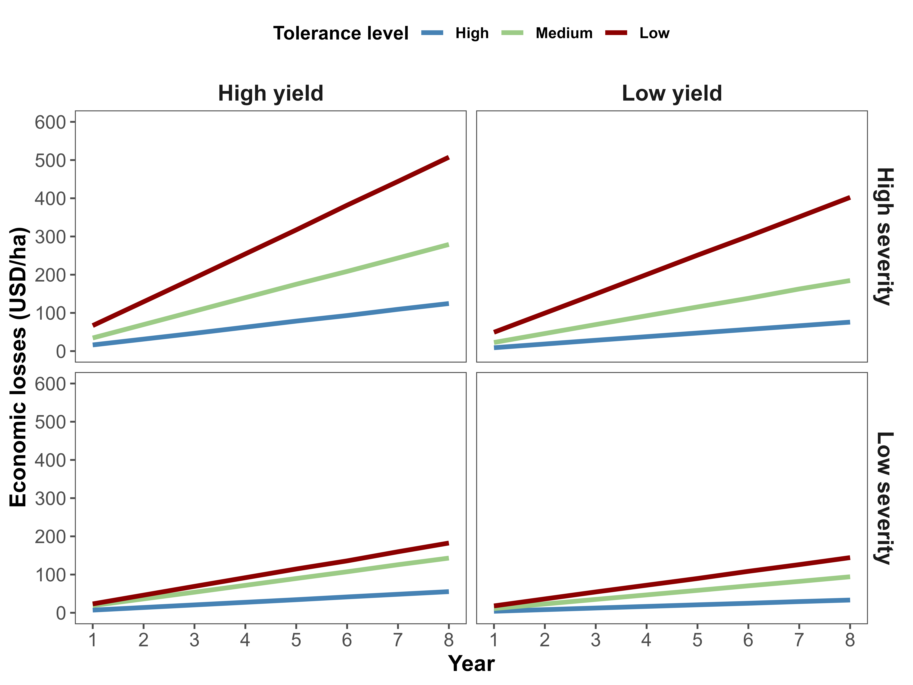

# Package

```{r}
library(tidyverse)
library(dplyr)
library(metafor)
library(ggplot2)
library(gsheet)
library(cowplot)
library(broom)
library(writexl)
library(readxl)
library(ggthemes)
library(minpack.lm)
```

# Importation

```{r}
ma <- gsheet2tbl("https://docs.google.com/spreadsheets/d/151DE26uSMN4WBS0PTQcjdw7BO56gXy_VilFZS3b9AAM/edit?usp=sharing")

molina = read_xlsx("data/molina.xlsx")

```

```{r}
unique(ma$cultivar)

ma |> 
  filter(!cultivar %in% c("63i64RSF IPRO","8579 RSF IPRO",
  "CD 2728 IPRO","DM 75i76 IPRO","M8210 IPRO","TMG 2181 IPRO")) %>% 
  filter(!is.na(sev)) |> 
  ggplot(aes(sev))+
  geom_histogram(fill = "#D2691E", color = "white")+
  ggthemes::theme_few()+
  #theme_minimal()+
  #facet_wrap(~year)+
  labs(x = "TS Severity (%)",
       y = "Count")+
  facet_wrap(~cultivar)+
  theme(axis.title.x = element_text(face = "bold"),
        axis.title.y = element_text(face = "bold"))

```

# Cluster

```{r}
ma1 = ma %>% 
  dplyr::select(study, cultivar, sev,yld,block,ai,state,year)

molina1 = molina %>% 
  dplyr::select(study, cultivar, sev,yield,rep,fungic,state,year)

colnames(molina1) = c("study","cultivar","sev","yld","block","ai","state","year")

ma_c = rbind(ma1,molina1)

unique(ma_c$state)
ma_c = ma_c %>% 
  filter(!is.na(yld)) %>% 
  filter(!is.na(sev)) %>% 
  filter(!is.na(cultivar))

ma_c_reg = ma_c  %>%
  #dplyr::select(active_ingredient, block, sev,yld) %>%
  group_by(cultivar) %>% 
  do(tidy(lm(.$yld ~ .$sev)))
ma_c_reg


ma_c_reg = ma_c_reg |> 
filter(term %in% c("(Intercept)",".$sev"))
 
ma_c_reg[ma_c_reg$term== "(Intercept)",c("parameters")] <- "Intercept"
ma_c_reg[ma_c_reg$term== ".$sev",c("parameters")] <- "Slope"


b1_c = ma_c_reg |> 
  dplyr::filter(parameters == "Slope") |> 
  #filter(estimate < 0) %>% 
  dplyr::group_by(cultivar) |> 
  summarise(
    Slope = estimate
  )

b0_c = ma_c_reg |> 
  filter(parameters == "Intercept") |>
  group_by(cultivar) |> 
  summarise(
    Intercept = estimate
  )

parameters_c = cbind(b1_c,b0_c)
parameters_c[,3] = NULL

parameters_c = parameters_c %>% 
  filter(!cultivar %in% c("BÔNUS","M9144_RR","74178 RSF IPRO"))

dc_c = parameters_c %>% 
  group_by(cultivar) %>% 
  summarise(
    DC = (Slope/Intercept)*-1,
    b1= Intercept/1000,
    DC = DC,
    DC_perc = DC*100
  )

set.seed(123)
dados_dummy <- model.matrix(~ cultivar - 1, data = dc_c)

set.seed(123)
dados_preparados <- cbind(dados_dummy, DC = dc_c$DC)

set.seed(123)
resultado_kmeans <- kmeans(dados_preparados, centers = 3)

```

```{r}

library(factoextra)

p = fviz_cluster(resultado_kmeans, data = dados_preparados, label = NULL,geom = "point",pointsize = 3, shape = 20)
p2 = p + theme_few() +
  scale_color_manual(values = c('#9ccb86','#cf597e','steelblue'))+
  scale_fill_manual(values = c('#9ccb86','#cf597e','steelblue'))+
  theme(
    text = element_text(size = 14, face = "bold"),  
    axis.title = element_text(size = 14),  
    axis.text = element_text(size = 14), 
    legend.title = element_text(size = 14),  
    legend.text = element_text(size = 14)) + 
  labs(
    title = "",  
    x = "PC1",  
    y = "PC2")+
  theme(legend.position = "none")


p2

ggsave("fig/k-means.png", dpi = 600, width = 8, height = 6)

```

```{r}
dc_c$Cluster <- resultado_kmeans$cluster

dc_c %>% 
  ggplot(aes(DC))+
  geom_histogram(color = "white",fill = "steelblue")+
  facet_wrap(~Cluster)+
  #scale_x_continuous(breaks = c(0, 0.1, 0.2, 0.3), limits = c(0, 0.3))+
  theme_minimal()+
  theme(text= element_text(size = 14, face = "bold"))

c_01 = dc_c %>% 
  filter(Cluster == 1)

c_02 = dc_c %>% 
  filter(Cluster == 2)

c_03 = dc_c %>% 
  filter(Cluster == 3)

c_01$cultivar
c_02$cultivar
c_03$cultivar
```
# Number of trials by cultivar

```{r}
study_counts <- ma_c %>%
  filter(!cultivar %in% c("BÔNUS","74178 RSF IPRO")) %>% 
  group_by(cultivar,year) %>%
  summarise(n_study = n_distinct(study)) %>% 
  group_by(cultivar) %>% 
  summarise(n_study = sum(n_study))

write_xlsx(study_counts,"data/study_counts.xlsx")
```
```{r}
sum(study_counts$n_study)
```


# Number of trials
```{r}
count_study = ma_c %>%
  #filter(!cultivar %in% c("BÔNUS","M9144_RR","74178 RSF IPRO")) %>% 
  group_by(study) %>%
  summarise(n_study = n_distinct(year))
```
```{r}
sum(count_study$n_study)
```

# Descriptive analysis

## Overall

```{r}
sev = ma |> 
  filter(!is.na(sev)) |> 
  ggplot(aes(sev))+
  geom_histogram(fill = "#D2691E", color = "white")+
  #D2691E
  ggthemes::theme_few()+
  #theme_minimal()+
  #facet_wrap(~year)+
  labs(x = "TS Severity (%)",
       y = "Count")+
  theme(axis.title.x = element_text(face = "bold"),
        axis.title.y = element_text(face = "bold"))
#00798C
#236E96
sev_log = ma |> 
  filter(!is.na(sev)) |> 
  ggplot(aes(log10(sev)))+
  geom_histogram(fill = "#D2691E", color = "white")+
  #theme_minimal()+
  ggthemes::theme_few()+
  #facet_wrap(~year)+
  labs(x = "log10(TS severity)",
       y = "Count")+
  theme(axis.title.x = element_text(face = "bold"),
        axis.title.y = element_text(face = "bold"))

yld = ma |> 
  filter(!is.na(yld)) |> 
  ggplot(aes(yld))+
  geom_histogram(fill = "#D2691E", color = "white")+
  #scale_y_continuous(breaks = c(0, 200, 400, 600,800), limits = c(0, 800))+
  ggthemes::theme_few()+
  #theme_minimal()+
  #facet_wrap(~year)+
  labs(x = "Yield (Kg/ha)",
       y = "Count")+
  theme(axis.title.x = element_text(face = "bold"),
        axis.title.y = element_text(face = "bold"))
#FF9933
plot_grid(sev,sev_log,yld, labels = c("A","B","C"), nrow = 3, align = "V")

ggsave("fig/overall.png", bg = "white", dpi = 600, height = 9, width = 10)
```

## Cultivar

### Severity

```{r}
sev_cultivar = ma |> 
  filter(ai == "_CHECK") %>% 
  filter(cultivar %in% c("63i64RSF IPRO","859 RSF IPRO",
  "CD 2728 IPRO","DM 75i76 IPRO","M8210 IPRO","TMG 2181 IPRO","HO MARACAÍ IPRO")) %>% 
  filter(!is.na(sev)) |> 
  ggplot(aes(sev))+
  geom_histogram(fill = "#D2691E", color = "white", bins = 10)+
  #theme_minimal()+
  ggthemes::theme_few()+
  #facet_wrap(~year)+
  labs(x = "TS severity",
       y = "Count")+
  #facet_wrap(~condition)+
  theme(axis.title.x = element_text(face = "bold"),
        axis.title.y = element_text(face = "bold"))

sev_cultivar

ggsave("fig/cultivar_severity.png", bg = "white", dpi = 600, height = 9, width = 10)
```

### Yield

```{r}
yld_cultivar = ma |> 
  filter(cultivar %in% c("63i64RSF IPRO","879 RSF IPRO",
  "CD 2728 IPRO","DM 75i76 IPRO","M8210 IPRO","TMG 2181 IPRO","HO MARACAÍ IPRO")) %>% 
  filter(!is.na(yld)) |> 
  ggplot(aes(yld))+
  geom_histogram(fill = "#D2691E", color = "white", bins = 10)+
  #scale_y_continuous(breaks = c(0, 200, 400, 600,800), limits = c(0, 800))+
  ggthemes::theme_few()+
  #theme_minimal()+
  #facet_wrap(~year)+
  labs(x = "Yield (Kg/ha)",
       y = "Count")+
  #facet_wrap(~condition)+
  theme(axis.title.x = element_text(face = "bold"),
        axis.title.y = element_text(face = "bold"))

yld_cultivar

ggsave("fig/cultivar_yield.png", bg = "white", dpi = 600, height = 9, width = 10)
```

## Active ingredients

### Severity

```{r}
sev_ai = ma |> 
  filter(ai %in% c("BIX+PROT+TRIFL","AZOX+TEBU+MANC","FLUX+PYRA","_CHECK")) %>% 
  filter(!is.na(sev)) |> 
  ggplot(aes(sev))+
  geom_histogram(fill = "#D2691E", color = "white", bins = 10)+
  #theme_minimal()+
  ggthemes::theme_few()+
  #facet_wrap(~year)+
  labs(x = "TS severity",
       y = "Count")+
  facet_wrap(~ai)+
  theme(axis.title.x = element_text(face = "bold"),
        axis.title.y = element_text(face = "bold"))

sev_ai

ggsave("fig/ai_severity.png", bg = "white", dpi = 600, height = 9, width = 10)
```

### Yield

```{r}
yld_ai = ma |> 
  filter(ai %in% c("BIX+PROT+TRIFL",
                   "AZOX+TEBU+MANC","FLUX+PYRA","_CHECK")) %>%
  filter(!is.na(yld)) |> 
  ggplot(aes(yld))+
  geom_histogram(fill = "#D2691E", color = "white", bins = 15)+
  #scale_y_continuous(breaks = c(0, 200, 400, 600,800), limits = c(0, 800))+
  ggthemes::theme_few()+
  #theme_minimal()+
  #facet_wrap(~year)+
  labs(x = "Yield (Kg/ha)",
       y = "Count")+
  facet_wrap(~ai)+
  theme(axis.title.x = element_text(face = "bold"),
        axis.title.y = element_text(face = "bold"))

yld_ai

ggsave("fig/ai_yield.png", bg = "white", dpi = 600, height = 9, width = 10)
```

## Cultivar x Active ingredients

### Severity

```{r}
sev_cultivar_ai = ma |> 
  filter(!is.na(sev)) %>% 
   filter(cultivar %in% c("63i64RSF IPRO","8579 RSF IPRO","CD 2728 IPRO", "DM 75i76 IPRO","M8210 IPRO","TMG 2181 IPRO")) %>% 
  filter(ai %in% c("BIX+PROT+TRIFL","AZOX+TEBU+MANC","FLUX+PYRA")) %>% 
  ggplot(aes(reorder(ai,+sev),sev))+
  #geom_jitter(color = "black",alpha = .2, width = 0.09, size = 2)+
  geom_boxplot(fill = NA, color = "steelblue",outlier.colour = NA,position = position_dodge(width =  0.95))+
  theme_minimal()+
  coord_flip()+
  #facet_wrap(~condition)+
  labs(x = "",
       y = "TS Severity (%)")+
  theme(strip.text = element_text(size = 12, face = "bold"),
        axis.title.x = element_text(face = "bold"),
        axis.title.y = element_text(face = "bold"))
```

### Yield

```{r}
yld_cultivar_ai = ma |> 
  filter(!is.na(sev)) %>% 
   filter(cultivar %in% c("63i64RSF IPRO","8579 RSF IPRO","CD 2728 IPRO", "DM 75i76 IPRO","M8210 IPRO","TMG 2181 IPRO")) %>% 
  filter(ai %in% c("BIX+PROT+TRIFL","AZOX+TEBU+MANC","FLUX+PYRA")) %>% 
  ggplot(aes(reorder(ai,+yld),yld))+
  #geom_jitter(color = "black",alpha = .2, width = 0.09, size = 2)+
  geom_boxplot(fill = NA, color = "steelblue",outlier.colour = NA,position = position_dodge(width =  0.95))+
  theme_minimal()+
  coord_flip()+
  #facet_wrap(~condition)+
  labs(x = "",
       y = "Yield (kg/ha)")+
  theme(strip.text = element_text(size = 12, face = "bold"),
        axis.title.x = element_text(face = "bold"),
        axis.title.y = element_text(face = "bold"))
```

# Framework simulation

```{r}
gera.norm.bid.geral<-function(tamanho.amostra,correlacao,m1,m2,sigma1,sigma2)
{
  ro<-correlacao
  n<-tamanho.amostra
  x<-matrix(0,n,2)
  for (i in 1:n)
  {x[i,1]<-rnorm(1,m1,sigma1)
  x[i,2]<-rnorm(1,m2+ro*sigma1/sigma2*(x[i,1]-m1),sigma2*(sqrt(1-ro^2)))
  }
  return(x)
}

gc()
```

## HIGH-TOLERANCE

```{r}

res = ma_c %>%
  filter(cultivar %in% c_03$cultivar)
  
unique(res$cultivar)

res_regression = res  %>%
  group_by(study) %>% 
  do(tidy(lm(.$yld ~ .$sev)))

res_regression = as.data.frame(res_regression)
res_regression
```

```{r}
res_severity = res |>  
  filter(ai == "_CHECK") %>%
  ggplot(aes(sev))+
  geom_histogram(color = "white",fill = "steelblue", bins =  10)+
  scale_x_continuous(limits = c(0, 100),
                     breaks = seq(0, 1000, by = 10))+
  theme_bw()+
  labs(x = "Severity (%)",
       y = "Density")

res_yield = res |>
  filter(ai == "_CHECK") %>%
  ggplot(aes(yld))+
  geom_histogram(color = "white",fill = "brown", bins = 10)+
  scale_x_continuous(limits = c(2000, 7000),
                     breaks = seq(2000, 7000, by = 500))+
  theme_bw()+
  labs(x = "Yield (kg/ha)",
       y = "")
plot_grid(res_severity,res_yield)
```

```{r}
res_regression = res_regression |> 
filter(term %in% c("(Intercept)",".$sev"))
 
res_regression[res_regression$term== "(Intercept)",c("parameters")] <- "Intercept"
res_regression[res_regression$term== ".$sev",c("parameters")] <- "Slope"

res_b0 = res_regression |> 
  filter(parameters == "Intercept") 

res_b1= res_regression %>% 
  filter(parameters == "Slope") %>% 
  filter(!estimate > 0)

mean(res_b0$estimate)
sd(res_b0$estimate)

mean(res_b1$estimate)
sd(res_b1$estimate)
```

### Intercept

```{r}
intercept_tss_res = res_regression |> 
  filter(parameters == "Intercept")

mean_intercept_res = mean(intercept_tss_res$estimate)
sd_intercept_res = sd(intercept_tss_res$estimate)

plot(ecdf(intercept_tss_res$estimate))
curve(pnorm(x, mean_intercept_res,sd_intercept_res), add = T, col = "red")
```

#### Kolmogorov-Smirnov Test

```{r}
Fx_res_b0 = environment(ecdf(intercept_tss_res$estimate))$y
x_res_b0= environment(ecdf(intercept_tss_res$estimate))$x
ks.test(Fx_res_b0, pnorm(x_res_b0, mean(intercept_tss_res$estimate), sd(intercept_tss_res$estimate)))
```

```{r}
plot(Fx_res_b0, pnorm(x_res_b0, mean(intercept_tss_res$estimate), sd(intercept_tss_res$estimate)))
abline(a=0,b=1)
```

```{r}
intercep_plot_res = intercept_tss_res %>% 
  ggplot(aes(estimate))+
  geom_histogram(aes(y = ..density..), bins = 8,color = "white", fill = "#FF4917")+
  #stat_function(fun=function(x) dnorm(x, mean_intercept_res, sd_intercept_res), color ="black", size =1.2)+
  theme_bw()+
  labs(x="Intercept (kg/ha)", y = "Density")
intercep_plot_res
```

### Slope

```{r}
slope_tss_res = res_regression |> 
  filter(parameters == "Slope") %>% 
  filter(!estimate > 0)
  

mean_slope = mean(slope_tss_res$estimate)
sd_slope = sd(slope_tss_res$estimate)

plot(ecdf(slope_tss_res$estimate))
curve(pnorm(x, mean_slope, sd_slope), add = T, col = "red")
```

#### Kolmogorov-Smirnov Test

```{r}
library(minpack.lm)
Fx =environment(ecdf(-slope_tss_res$estimate))$y
x = environment(ecdf(-slope_tss_res$estimate))$x

slope_reg = nlsLM(Fx ~ pgamma(x, shape, rate,log = FALSE) ,
      start = c(shape = 2.5, rate = 0.13),
      control = nls.lm.control(maxiter = 1024))
summary(slope_reg)

```

```{r}
shape_res = summary(slope_reg)$coef[1]
rate_res = summary(slope_reg)$coef[2]

Fx =environment(ecdf(-slope_tss_res$estimate))$y
x = environment(ecdf(-slope_tss_res$estimate))$x
ks.test(Fx, pgamma(x, shape_res, rate_res))
```

```{r}
shape_res = summary(slope_reg)$coef[1]
rate_res = summary(slope_reg)$coef[2]

slope_plot_res = slope_tss_res %>% 
  ggplot(aes(estimate))+
 geom_histogram(aes(y = ..density..),bins = 20, color = "white", fill = "#159EE6")+
  scale_x_continuous(breaks = c(-200,-150,-100,-50,0),
                     limits = c(-200,0))+
  theme_bw()+
  labs(x="Slope (kg/p.p.)", y = "Density")
slope_plot_res
```

### Correlation

```{r}
slope_coefficient_res = res_regression |> 
  dplyr::filter(parameters == "Slope") |> 
  #filter(estimate < 0) %>% 
  dplyr::group_by(study) |> 
  summarise(
    Slope = estimate
  )

slope_coefficient_res[,1] = NULL

slope_coefficient_res |> 
  filter(!Slope == "NA") |> 
  summarise(
mean = mean(Slope))

intercept_coefficient_res = res_regression |> 
  filter(parameters == "Intercept") |>
  group_by(study) |> 
  summarise(
    Intercept = estimate
  )

mean(intercept_coefficient_res$Intercept)
sd(intercept_coefficient_res$Intercept)

regression_res = cbind(slope_coefficient_res,intercept_coefficient_res)
regression_res = regression_res %>% 
  filter(Slope <0)

correlation <- function(x, y) {
  if (length(x) != length(y)) {
    stop("Os vetores 'x' e 'y' devem ter o mesmo comprimento")
  }
  
  cor_result <- cor(x, y, use = "complete.obs")
  
  return(cor_result)
}

correlation(regression_res$Slope, regression_res$Intercept)
```

```{r}
corr_actual_plot_res = regression_res %>%
  mutate(alfa =(Slope/Intercept)*100) %>% 
  #filter(alfa > -3 & alfa < 0) %>% 
ggplot(aes(Intercept,Slope))+
  geom_point( size =2, color = "black")+
  # geom_density_2d(color = "black")+
  geom_smooth(method = lm, color = "red", se = F, size = 1.2)+
   #scale_x_continuous(breaks = c(3500,4000,4500,5000,5500), limits = c(3500, 5500))+
  scale_y_continuous(breaks = c(-160,-150,-140,-130,-120,-110,-100,-90,-80,-70,-60,-50,-40,-30,-20,-10,0), limits = c(-160, 0))+
  ggthemes::theme_few()+
  labs(y= "Slope",
       x = "Intercept",
       title = "Empirical: r = -0.518")+
  theme(text = element_text(face = "bold"))
 # coord_cartesian(
  #  xlim = c(0,10000))

corr_actual_plot_res
```

```{r}

j_res<-gera.norm.bid.geral(10000,0.51,0,0,1,1)

plot(j_res[,1],j_res[,2])
```

## Severity

#### Kolmogorov-Smirnov Test

```{r}


sev_res = ma_c %>%
  filter(cultivar %in% c_03$cultivar) %>% 
  filter(ai %in% c("ZZ_CHECK","_CHECK"))
  

sev_r = sev_res$sev
Fx_res = environment(ecdf(sev_r))$y
x_res = environment(ecdf(sev_r))$x/100

summary(nlsLM(Fx_res ~ pbeta(x_res, shape1, shape2, log = FALSE) ,
      start = c(shape1 = 1, shape2 = 1),
      control = nls.lm.control(maxiter = 100000)))

ks.test(Fx_res,pbeta(x_res,3.42200,4.75064))

```

#### Plot

```{r}

plot(x_res,Fx_res)
curve(pbeta(x, 3.42200,4.75064),0,1, add = T)
```

```{r}
sev_dist_plot_res = sev_res %>%
  ggplot(aes(sev/100))+
 geom_histogram(aes(y = ..density..),bins = 8, color = "white", fill = "darkgreen")+
  scale_x_continuous(breaks = c(1.00,0.75,0.50,0.25,0.00), 
                     limits = c(0.00,1.00))+
  theme_bw()+
  labs(x="Severity (proportion)", y = "Density")
sev_dist_plot_res
```

## Relative yield loss

```{r}
empiric_ryl_res= regression_res %>% 
  mutate(cc = (Slope/Intercept)*100)
 # filter( cc > -3 & cc <0 )
head(empiric_ryl_res)
```

```{r}
stat_emp_ryl_res =empiric_ryl_res%>% 
  summarise(data = "empirical",
            mean =  mean(cc),
            median =  median(cc),
            variance = var(cc))
```

```{r}
real_RYL_res= empiric_ryl_res %>% 
  ggplot(aes(cc))+
 geom_histogram(aes(y = ..density..), bins = 12, color = "white", fill = "black")+
 # scale_y_continuous(limits = c(0,1.4),breaks =  seq(0, 1.4,by = 0.4))+
  geom_vline(data = stat_emp_ryl_res, aes(xintercept = mean, color = "Mean"),size =1)+
  geom_vline(data = stat_emp_ryl_res, aes(xintercept = median, color = "Median"),size =1)+
  scale_x_continuous(breaks = c(-2.0,-1.75,-1.50,-1.25,-1.00,-0.75,-0.50,-0.25,0.0), limits = c(-2.0,0.0))+
  ggthemes::theme_few()+
  scale_color_calc()+
  labs(x = "",
       y = "Frequency",
       color = "",
       title = "Empirical | High")+
 # xlim(-3,0.2)+
  theme(legend.position = "none",
        text = element_text(face = "bold"))
real_RYL_res
```

```{r}
mean(res_b0$estimate)
sd(res_b0$estimate)

b0_res = pnorm(j_res[,2])
b0_t_res = qnorm(b0_res, 3902.37, 662*sqrt(33))
hist(b0_t_res, prob = T)
curve(dnorm(x, mean_intercept_res, sd_intercept_res), add = T)

mean(res_b0$estimate)
sd(res_b0$estimate)


b1_res = pnorm(j_res[,1])
b1_t_res = qgamma(b1_res, shape = shape_res, rate = rate_res)*-1
hist(b1_t_res, prob = T)
curve(dgamma(-x,shape=shape_res, rate = rate_res), add = T)
```

```{r}
if(!require(devtools)) install.packages("devtools")
devtools::install_github("kassambara/ggpubr")

correlation(b1_t_res, b0_t_res)

cor.test(b1_t_res, b0_t_res, method = "pearson")

```

```{r}
actual_cc_res = regression_res %>% 
  mutate(cc = (Slope/Intercept)*100)

simulated_cc_res = data.frame(b0_t_res, b1_t_res, 
                              cc = (b1_t_res/b0_t_res)*100)%>% 
  filter( cc > -3 & cc <0 )

ks.test(actual_cc_res$cc, simulated_cc_res$cc)

```

```{r}
fx_actual_res = environment(ecdf(actual_cc_res$cc))$y
fx_simu_res = environment(ecdf(simulated_cc_res$cc))$y
ks.test((fx_actual_res),(fx_simu_res))
```

```{r}
ecdf_damage_res = ggplot()+
  stat_ecdf(aes(simulated_cc_res$cc,color = "Simulated"), size=1.2,geom = "step")+
  stat_ecdf(aes(actual_cc_res$cc, color = "Empirical"), size=1.2,geom = "step")+
  ggthemes::theme_few()+
  scale_color_manual(values = c("black","orange"))+
  labs(y = "Probability",
       x = "Relative percent yield loss",
       color ="",
       title = "CDF | High")+
  theme(legend.position = "top",
        legend.background = element_blank(),
        text = element_text(face = "bold"))
ecdf_damage_res
```

```{r}
corr_sim_plot_res = data.frame(b0_t_res,b1_t_res) %>%
  mutate(alfa =(b1_t_res/b0_t_res)*100 ) %>% 
  #filter(alfa > -3 & alfa < 0) %>% 
ggplot(aes(b0_t_res,b1_t_res))+
  geom_point( size =2, color = "orange", alpha =0.3)+
  # geom_density_2d(color = "black")+
  geom_smooth(method = lm, color = "red", se = F, size = 1.2)+
   scale_x_continuous(breaks = c(0,1000,2000,3000,4000,5000,6000,7000,8000,9000,10000), limits = c(0, 10000))+
  scale_y_continuous(breaks = c(-160,-150,-140,-130,-120,-110,-100,-90,-80,-70,-60,-50,-40,-30,-20,-10,0), limits = c(-160, 0))+
  ggthemes::theme_few()+
  labs(y= "Slope",
       x = "Intercept",
       title = "Simulated: r = -0.476")+
  coord_cartesian(
    xlim = c(0,7000),
    ylim = c(-160,0)
  )+
  theme(text = element_text(face = "bold"))
corr_sim_plot_res
```

## MEDIUM-TOLERANCE

```{r}


m_sus = ma_c %>%
  filter(cultivar %in% c_01$cultivar)

unique(m_sus$cultivar)

m_sus_regression = m_sus  %>%
  group_by(study) %>% 
  do(tidy(lm(.$yld ~ .$sev)))

m_sus_regression = as.data.frame(m_sus_regression)
m_sus_regression
```

```{r}
m_sus_severity = m_sus |> 
  filter(ai == "_CHECK") %>%
  ggplot(aes(sev))+
  geom_histogram(color = "white",fill = "steelblue", bins =  10)+
  scale_x_continuous(limits = c(0, 100),
                     breaks = seq(0, 1000, by = 10))+
  theme_bw()+
  labs(x = "Severity (%)",
       y = "Density")

m_sus_yield = m_sus |>
  filter(ai == "_CHECK") %>%
  ggplot(aes(yld))+
  geom_histogram(color = "white",fill = "brown", bins = 10)+
  scale_x_continuous(limits = c(2000, 7000),
                     breaks = seq(2000, 7000, by = 500))+
  theme_bw()+
  labs(x = "Yield (kg/ha)",
       y = "")
plot_grid(m_sus_severity,m_sus_yield)
```

```{r}
m_sus_regression = m_sus_regression |> 
filter(term %in% c("(Intercept)",".$sev"))
 
m_sus_regression[m_sus_regression$term== "(Intercept)",c("parameters")] <- "Intercept"
m_sus_regression[m_sus_regression$term== ".$sev",c("parameters")] <- "Slope"

m_sus_b0 = m_sus_regression |> 
  filter(parameters == "Intercept") 

m_sus_b1 = m_sus_regression |> 
  filter(parameters == "Slope") %>% 
  filter(!estimate >0)

mean(m_sus_b0$estimate)
sd(m_sus_b0$estimate)

mean(m_sus_b1$estimate)
sd(m_sus_b1$estimate)
```

### Intercept

```{r}
intercept_tss_m_sus = m_sus_regression |> 
  filter(parameters == "Intercept")

mean_intercept_m_sus = mean(intercept_tss_m_sus$estimate)
sd_intercept_m_sus = sd(intercept_tss_m_sus$estimate)

plot(ecdf(intercept_tss_m_sus$estimate))
curve(pnorm(x, mean_intercept_m_sus,
            sd_intercept_m_sus), add = T, col = "red")
```

#### Kolmogorov-Smirnov Test

```{r}
Fx_m_sus_b0 = environment(ecdf(intercept_tss_m_sus$estimate))$y
x_m_sus_b0= environment(ecdf(intercept_tss_m_sus$estimate))$x
ks.test(Fx_m_sus_b0, pnorm(x_m_sus_b0, mean(intercept_tss_m_sus$estimate), sd(intercept_tss_m_sus$estimate)))
```

```{r}
plot(Fx_m_sus_b0, pnorm(x_m_sus_b0, mean(intercept_tss_m_sus$estimate), sd(intercept_tss_m_sus$estimate)))
abline(a=0,b=1)
```

```{r}
intercep_plot_m_sus = intercept_tss_m_sus %>% 
  ggplot(aes(estimate))+
  geom_histogram(aes(y = ..density..),bins = 8, color = "white", fill = "#FF4917")+
  #stat_function(fun=function(x) dnorm(x, mean_intercept_m_sus, sd_intercept_m_sus), color ="black", size =1.2)+
  theme_bw()+
  labs(x="Intercept (kg/ha)", y = "Density")
intercep_plot_m_sus
```

### Slope

```{r}
slope_tss_m_sus = m_sus_regression |> 
  filter(parameters == "Slope") %>% 
  filter(!estimate > 0) %>% 
  filter(!estimate > -10)

mean_slope_m_sus = mean(slope_tss_m_sus$estimate)
sd_slope_m_sus = sd(slope_tss_m_sus$estimate)

plot(ecdf(slope_tss_m_sus$estimate))
curve(pnorm(x, mean_slope_m_sus, sd_slope_m_sus), add = T, col = "red")
```

#### Kolmogorov-Smirnov Test

```{r}
Fx_m_sus_b1 =environment(ecdf(-slope_tss_m_sus$estimate))$y
x_m_sus_b1 = environment(ecdf(-slope_tss_m_sus$estimate))$x

slope_m_sus = nlsLM(Fx_m_sus_b1 ~ pgamma(x_m_sus_b1,
                    shape, rate,log = FALSE) ,
      start = c(shape = 2.5, rate = 0.13),
      control = nls.lm.control(maxiter = 1024))
summary(slope_m_sus)
```

```{r}
shape_m_sus = summary(slope_m_sus)$coef[1]
rate_m_sus = summary(slope_m_sus)$coef[2]

Fx_m_sus_b1 =environment(ecdf(-slope_tss_m_sus$estimate))$y
x_m_sus_b1 = environment(ecdf(-slope_tss_m_sus$estimate))$x
ks.test(Fx_m_sus_b1, pgamma(x_m_sus_b1, shape_m_sus, rate_m_sus))
```

```{r}
slope_plot_m_sus = slope_tss_m_sus %>% 
  ggplot(aes(estimate))+
 geom_histogram(aes(y = ..density..),bins = 8, color = "white", fill = "#159EE6")+
  theme_bw()+
scale_x_continuous(breaks = c(-200,-150,-100,-50,0),
                   limits = c(-200,0))+
  labs(x="Slope (kg/p.p.)", y = "Density")
slope_plot_m_sus
```

### Correlation

```{r}
slope_coefficient_m_sus = m_sus_regression |> 
  filter(parameters == "Slope") |> 
  #filter(estimate < 0) %>% 
  group_by(study) |> 
  summarise(
    Slope = estimate
  )

slope_coefficient_m_sus[,1] = NULL

slope_coefficient_m_sus |> 
  filter(!Slope == "NA") |> 
  summarise(
mean = mean(Slope))

intercept_coefficient_m_sus = m_sus_regression |> 
  filter(parameters == "Intercept") |>
  group_by(study) |> 
  summarise(
    Intercept = estimate
  )

mean(intercept_coefficient_m_sus$Intercept)
sd(intercept_coefficient_m_sus$Intercept)

regression_m_sus = cbind(slope_coefficient_m_sus,intercept_coefficient_m_sus)

regression_m_sus = regression_m_sus %>% 
  filter(Slope <0)

correlation(regression_m_sus$Slope, regression_m_sus$Intercept)
```

```{r}
corr_actual_plot_m_sus = regression_m_sus %>%
  mutate(alfa =(Slope/Intercept)*100) %>% 
  #filter(alfa > -3 & alfa < 0) %>% 
ggplot(aes(Intercept,Slope))+
  geom_point( size =2, color = "black")+
  # geom_density_2d(color = "black")+
  geom_smooth(method = lm, color = "red", se = F, size = 1.2)+
  # scale_x_continuous(breaks = c(0,1000,2000,3000,4000,5000,6000,7000,8000,9000,10000), limits = c(0, 10000))+
    scale_y_continuous(breaks = c(-160,-150,-140,-130,-120,-110,-100,-90,-80,-70,-60,-50,-40,-30,-20,-10,0), limits = c(-160, 0))+
  ggthemes::theme_few()+
  labs(y= "Slope",
       x = "Intercept",
       title = "Empirical: r = -0.734")+
  theme(text = element_text(face = "bold"))
 # coord_cartesian(
  #  xlim = c(0,10000))

corr_actual_plot_m_sus
```

```{r}
plot_grid(corr_actual_plot_res,corr_actual_plot_m_sus,ncol = 2, labels = c("AUTO"))
```

```{r}

j_m_sus<-gera.norm.bid.geral(10000,0.73,0,0,1,1)

plot(j_m_sus[,1],j_m_sus[,2])
```

## Severity

#### Kolmogorov-Smirnov Test

```{r}


sev_m_sus = ma_c %>%
  filter(cultivar %in% c_01$cultivar) %>% 
  filter(ai %in% c("ZZ_CHECK","_CHECK"))


sev_m_s = sev_m_sus$sev
Fx_m_sus= environment(ecdf(sev_m_s))$y
x_m_sus = environment(ecdf(sev_m_s))$x/100

summary(nlsLM(Fx_m_sus ~ pbeta(x_m_sus, shape1, shape2, log = FALSE) ,
      start = c(shape1 = 1, shape2 = 1),
      control = nls.lm.control(maxiter = 100000)))

ks.test(Fx_m_sus,pbeta(x_m_sus,4.4564,7.8184))

```

#### Plot

```{r}

plot(x_m_sus,Fx_m_sus)
curve(pbeta(x, 4.4564,7.8184),0,1, add = T)
```

```{r}
sev_dist_plot_m_sus = sev_m_sus %>%
  ggplot(aes(sev/100))+
 geom_histogram(aes(y = ..density..), bins = 8, color = "white", fill = "darkgreen")+
  scale_x_continuous(breaks = c(1.00,0.75,0.50,0.25,0.00), 
                     limits = c(0.00,1.00))+
  theme_bw()+
  labs(x="Severity (proportion)", y = "Density")
sev_dist_plot_m_sus
```

## Relative yield loss

```{r}
empiric_ryl_m_sus= regression_m_sus %>% 
  mutate(cc = (Slope/Intercept)*100)
 # filter( cc > -3 & cc <0 )
head(empiric_ryl_m_sus)
```

```{r}
stat_emp_ryl_m_sus =empiric_ryl_m_sus%>% 
  summarise(data = "empirical",
            mean =  mean(cc),
            median =  median(cc),
            variance = var(cc))
```

```{r}
real_RYL_m_sus= empiric_ryl_m_sus %>% 
  ggplot(aes(cc))+
 geom_histogram(aes(y = ..density..), bins = 10, color = "white", fill = "black")+
 # scale_y_continuous(limits = c(0,1.4),breaks =  seq(0, 1.4,by = 0.4))+
  geom_vline(data = stat_emp_ryl_m_sus, aes(xintercept = mean, color = "Mean"),size =1)+
  geom_vline(data = stat_emp_ryl_m_sus, aes(xintercept = median, color = "Median"),size =1)+
  scale_x_continuous(breaks = c(-2.0,-1.75,-1.50,-1.25,-1.00,-0.75,-0.50,-0.25,0.0), limits = c(-2.0,0.0))+
  ggthemes::theme_few()+
  scale_color_calc()+
  labs(x = "",
       y = "",
       color = "",
       title = "Empirical | Medium")+
 # xlim(-3,0.2)+
  theme(legend.position = "none",
        text = element_text(face = "bold"))
real_RYL_m_sus
```

```{r}
mean(m_sus_b0$estimate)
sd(m_sus_b0$estimate)

b0_m_sus = pnorm(j_m_sus[,2])
b0_t_m_sus = qnorm(b0_m_sus, 4198.677, 619*sqrt(27))
hist(b0_t_m_sus, prob = T)
curve(dnorm(x, mean_intercept_m_sus, sd_intercept_m_sus), add = T)

b1_m_sus = pnorm(j_m_sus[,1])
b1_t_m_sus = qgamma(b1_m_sus, shape = shape_m_sus, rate = rate_m_sus)*-1
hist(b1_t_m_sus, prob = T)
curve(dgamma(-x,shape=shape_m_sus, rate = rate_m_sus), add = T)
```

```{r}
correlation(b1_t_m_sus, b0_t_m_sus)

cor.test(b1_t_m_sus, b0_t_m_sus, method = "pearson")
```

```{r}
actual_cc_m_sus = regression_m_sus %>% 
  mutate(cc = (Slope/Intercept)*100)

simulated_cc_m_sus = data.frame(b0_t_m_sus, b1_t_m_sus,
                                cc = (b1_t_m_sus/b0_t_m_sus)*100)%>% 
  filter( cc > -3 & cc <0 )

ks.test(actual_cc_m_sus$cc, simulated_cc_m_sus$cc)

```

```{r}
fx_actual_m_sus = environment(ecdf(actual_cc_m_sus$cc))$y
fx_simu_m_sus = environment(ecdf(simulated_cc_m_sus$cc))$y
ks.test((fx_actual_m_sus),(fx_simu_m_sus))
```

```{r}
ecdf_damage_m_sus = ggplot()+
  stat_ecdf(aes(simulated_cc_m_sus$cc,color = "Simulated"), size=1.2,geom = "step")+
  stat_ecdf(aes(actual_cc_m_sus$cc, color = "Empirical"), size=1.2,geom = "step")+
  ggthemes::theme_few()+
  scale_color_manual(values = c("black","orange"))+
  labs(y = "",
       x = "Relative percent yield loss",
       color ="",
       title = "CDF | Medium")+
  theme(legend.position = "top",
        legend.background = element_blank(),
        text = element_text(face = "bold"))
ecdf_damage_m_sus
```

```{r}
corr_sim_plot_m_sus = data.frame(b0_t_m_sus,b1_t_m_sus) %>%
  mutate(alfa =(b0_t_m_sus/b1_t_m_sus)*100 ) %>% 
  #filter(alfa > -3 & alfa < 0) %>% 
ggplot(aes(b0_t_m_sus,b1_t_m_sus))+
  geom_point( size =2, color = "orange", alpha =0.3)+
  # geom_density_2d(color = "black")+
  geom_smooth(method = lm, color = "red", se = F, size = 1.2)+
   scale_x_continuous(breaks = c(0,1000,2000,3000,4000,5000,6000,7000,8000,9000,10000), limits = c(0, 10000))+
  scale_y_continuous(breaks = c(-160,-150,-140,-130,-120,-110,-100,-90,-80,-70,-60,-50,-40,-30,-20,-10,0), limits = c(-160, 0))+
  ggthemes::theme_few()+
  labs(y= "Slope",
       x = "Intercept",
       title = "Simulated: r = -0.711")+
  coord_cartesian(
    xlim = c(0,7000),
    ylim = c(-160,0))+
  theme(text = element_text(face = "bold"))
corr_sim_plot_m_sus
```

```{r}
plot_grid(corr_actual_plot_res,corr_actual_plot_m_sus,corr_sim_plot_res,corr_sim_plot_m_sus, ncol = 2, labels = c("AUTO"))
```

## LOW-TOLERANCE

```{r}


susceptible = ma_c %>%
  filter(cultivar %in% c_02$cultivar)

sus_regression = susceptible%>%
  group_by(study,block) %>% 
  do(tidy(lm(.$yld ~ .$sev)))

sus_regression = as.data.frame(sus_regression)
sus_regression
```

```{r}
sus_severity = susceptible |> 
 # filter(ai == "_CHECK") %>%
  ggplot(aes(sev))+
  geom_histogram(color = "white",fill = "steelblue", bins =  15)+
  scale_x_continuous(limits = c(0, 100),
                     breaks = seq(0, 1000, by = 10))+
  theme_bw()+
  labs(x = "Severity (%)",
       y = "Density")

sus_yield = susceptible |>
  #filter(ai == "_CHECK") %>%
  ggplot(aes(yld))+
  geom_histogram(color = "white",fill = "brown", bins = 10)+
  scale_x_continuous(limits = c(2000, 7000),
                     breaks = seq(2000, 7000, by = 500))+
  theme_bw()+
  labs(x = "Yield (kg/ha)",
       y = "")
plot_grid(sus_severity,sus_yield)
```

```{r}
sus_regression = sus_regression |> 
filter(term %in% c("(Intercept)",".$sev"))
 
sus_regression[sus_regression$term== "(Intercept)",c("parameters")] <- "Intercept"
sus_regression[sus_regression$term== ".$sev",c("parameters")] <- "Slope"

sus_b0 = sus_regression |> 
  filter(parameters == "Intercept") %>% 
  filter(!estimate < 3000)

sus_b1 = sus_regression |> 
  filter(parameters == "Slope") %>% 
  filter(!estimate >0)

mean(sus_b0$estimate)
sd(sus_b0$estimate)

mean(sus_b1$estimate)
sd(sus_b1$estimate)
```

### Intercept

```{r}
intercept_tss_sus = sus_regression |> 
  filter(parameters == "Intercept") %>% 
  filter(!estimate < 3000)

mean_intercept_sus = mean(intercept_tss_sus$estimate)
sd_intercept_sus = sd(intercept_tss_sus$estimate)

plot(ecdf(intercept_tss_sus$estimate))
curve(pnorm(x, mean_intercept_sus,sd_intercept_sus), add = T, col = "red")
```

#### Kolmogorov-Smirnov Test

```{r}
Fx_sus_b0 = environment(ecdf(intercept_tss_sus$estimate))$y
x_sus_b0= environment(ecdf(intercept_tss_sus$estimate))$x
ks.test(Fx_sus_b0, pnorm(x_sus_b0, mean(intercept_tss_sus$estimate), sd(intercept_tss_sus$estimate)))
```

```{r}
plot(Fx_sus_b0, pnorm(x_sus_b0, mean(intercept_tss_sus$estimate), sd(intercept_tss_sus$estimate)))
abline(a=0,b=1)
```

```{r}
intercep_plot_sus = intercept_tss_sus %>% 
  ggplot(aes(estimate))+
  geom_histogram(aes(y = ..density..),bins = 8, color = "white", fill = "#FF4917")+
   # stat_function(fun=function(x) dnorm(x, mean_intercept_sus, sd_intercept_sus), color ="black", size =1.2)+
  theme_bw()+
  labs(x="Intercept (kg/ha)", y = "Density")
intercep_plot_sus
```

### Slope

```{r}
slope_tss_sus = sus_regression |> 
  filter(parameters == "Slope") %>% 
  filter(!estimate > 0)

mean_slope = mean(slope_tss_sus$estimate)
sd_slope = sd(slope_tss_sus$estimate)

plot(ecdf(slope_tss_sus$estimate))
curve(pnorm(x, mean_slope, sd_slope), add = T, col = "red")
```

#### Kolmogorov-Smirnov Test

```{r}
Fx =environment(ecdf(-slope_tss_sus$estimate))$y
x = environment(ecdf(-slope_tss_sus$estimate))$x

slope_sus = nlsLM(Fx ~ pgamma(x, shape, rate,log = FALSE) ,
      start = c(shape = 2.5, rate = 0.13),
      control = nls.lm.control(maxiter = 1024))
summary(slope_sus)
```

```{r}
shape_sus = summary(slope_sus)$coef[1]
rate_sus = summary(slope_sus)$coef[2]

Fx =environment(ecdf(-slope_tss_sus$estimate))$y
x = environment(ecdf(-slope_tss_sus$estimate))$x
ks.test(Fx, pgamma(x, shape_sus, rate_sus))
```

```{r}
shape_sus = summary(slope_sus)$coef[1]
rate_sus = summary(slope_sus)$coef[2]

slope_plot_sus = slope_tss_sus %>% 
  ggplot(aes(estimate))+
 geom_histogram(aes(y = ..density..),bins = 8, color = "white", fill = "#159EE6")+
    scale_x_continuous(breaks = c(-200,-150,-100,-50,0), limits = c(-200,0))+
  theme_bw()+
  labs(x="Slope (kg/p.p.)", y = "Density")
slope_plot_sus
```

### Correlation

```{r}
slope_coefficient_sus = sus_regression |> 
  filter(parameters == "Slope") |> 
  #filter(estimate < 0) %>% 
  group_by(block) |> 
  summarise(
    Slope = estimate
  )

slope_coefficient_sus[,1] = NULL

slope_coefficient_sus |> 
  filter(!Slope == "NA") |> 
  summarise(
mean = mean(Slope))

intercept_coefficient_sus = sus_regression |> 
  filter(parameters == "Intercept") |>
  group_by(block) |> 
  summarise(
    Intercept = estimate
  )

mean(intercept_coefficient_sus$Intercept)
sd(intercept_coefficient_sus$Intercept)

regression_sus = cbind(slope_coefficient_sus,intercept_coefficient_sus)
regression_sus = regression_sus %>% 
  filter(Slope <0)

correlation(regression_sus$Slope, regression_sus$Intercept)
```

```{r}
corr_actual_plot_sus = regression_sus %>%
  mutate(alfa =(Slope/Intercept)*100) %>% 
  #filter(alfa > -3 & alfa < 0) %>% 
ggplot(aes(Intercept,Slope))+
  geom_point( size =2, color = "black")+
  # geom_density_2d(color = "black")+
  geom_smooth(method = lm, color = "red", se = F, size = 1.2)+
  # scale_x_continuous(breaks = c(0,1000,2000,3000,4000,5000,6000,7000,8000,9000,10000), limits = c(0, 10000))+
  scale_y_continuous(breaks = c(-160,-150,-140,-130,-120,-110,-100,-90,-80,-70,-60,-50,-40,-30,-20,-10,0), limits = c(-160, 0))+
  ggthemes::theme_few()+
  labs(y= "Slope",
       x = "Intercept",
       title = "Empirical: r = -0.529")+
  theme(text = element_text(face = "bold"))
 # coord_cartesian(
  #  xlim = c(0,10000))

corr_actual_plot_sus
```

```{r}

j_sus<-gera.norm.bid.geral(10000,0.529,0,0,1,1)

plot(j_sus[,1],j_sus[,2])
```

### Severity

#### Kolmogorov-Smirnov Test

```{r}

sev_sus = ma_c %>%
  filter(cultivar %in% c_02$cultivar) %>% 
  filter(ai %in% c("ZZ_CHECK","_CHECK"))

sev_s = sev_sus$sev
Fx_sus= environment(ecdf(sev_s))$y
x_sus = environment(ecdf(sev_s))$x/100

summary(nlsLM(Fx_sus ~ pbeta(x_sus, shape1, shape2, log = FALSE) ,
      start = c(shape1 = 1, shape2 = 1),
      control = nls.lm.control(maxiter = 100000)))

ks.test(Fx_sus,pbeta(x_sus,1.4193,5.9858))

```

#### Plot

```{r}

plot(x_sus,Fx_sus)
curve(pbeta(x, 1.4193,5.9858),0,1, add = T)
```

```{r}
sev_dist_plot_sus = sev_sus %>%
  ggplot(aes(sev/100))+
 geom_histogram(aes(y = ..density..), bins = 12, color = "white", fill = "darkgreen")+
  scale_x_continuous(breaks = c(1.00,0.75,0.50,0.25,0.00), 
                     limits = c(0.00,1.00))+
  theme_bw()+
  labs(x="Severity (proportion)", y = "Density")
sev_dist_plot_sus
```

## Relative yield loss

```{r}
empiric_ryl_sus= regression_sus %>% 
  mutate(cc = (Slope/Intercept)*100)
 # filter( cc > -3 & cc <0 )
head(empiric_ryl_sus)
```

```{r}
stat_emp_ryl_sus =empiric_ryl_sus%>% 
  summarise(data = "empirical",
            mean =  mean(cc),
            median =  median(cc),
            variance = var(cc))
```

```{r}
real_RYL_sus= empiric_ryl_sus %>% 
  ggplot(aes(cc))+
 geom_histogram(aes(y = ..density..), bins = 10, color = "white", fill = "black")+
 # scale_y_continuous(limits = c(0,1.4),breaks =  seq(0, 1.4,by = 0.4))+
  geom_vline(data = stat_emp_ryl_sus, aes(xintercept = mean, color = "Mean"),size =1)+
  geom_vline(data = stat_emp_ryl_sus, aes(xintercept = median, color = "Median"),size =1)+
  scale_x_continuous(breaks = c(-2.0,-1.75,-1.50,-1.25,-1.00,-0.75,-0.50,-0.25,0.0), limits = c(-2.0,0.0))+
  ggthemes::theme_few()+
  scale_color_calc()+
  labs(x = "",
       y = "",
       color = "",
       title = "Empirical | Low")+
 # xlim(-3,0.2)+
  theme(legend.position = "none",
        text = element_text(face = "bold"))
real_RYL_sus
```

```{r}
mean(sus_b0$estimate)
sd(sus_b0$estimate)

b0_sus = pnorm(j_sus[,2])
b0_t_sus = qnorm(b0_sus, 4818.456, 426*sqrt(24))
hist(b0_t_sus, prob = T)
curve(dnorm(x, mean_intercept_sus, sd_intercept_sus), add = T)


b1_sus = pnorm(j_sus[,1])
b1_t_sus = qgamma(b1_sus, shape = shape_sus, rate = rate_sus)*-1
hist(b1_t_sus, prob = T)
curve(dgamma(-x,shape=shape_sus, rate = rate_sus), add = T)
```

```{r}
correlation(b1_t_sus, b0_t_sus)

cor.test(b1_t_sus, b0_t_sus, method = "pearson")
```

```{r}
actual_cc_sus = regression_sus %>% 
  mutate(cc = (Slope/Intercept)*100)

simulated_cc_sus = data.frame(b0_t_sus, b1_t_sus, cc = (b1_t_sus/b0_t_sus)*100)%>% 
  filter( cc > -3 & cc <0 )

ks.test(actual_cc_sus$cc, simulated_cc_sus$cc)
```

```{r}
fx_actual_sus = environment(ecdf(actual_cc_sus$cc))$y
fx_simu_sus = environment(ecdf(simulated_cc_sus$cc))$y
ks.test((fx_actual_sus),(fx_simu_sus))
```

```{r}
ecdf_damage_sus = ggplot()+
  stat_ecdf(aes(simulated_cc_sus$cc,color = "Simulated"), size=1.2,geom = "step")+
  stat_ecdf(aes(actual_cc_sus$cc, color = "Empirical"), size=1.2,geom = "step")+
  ggthemes::theme_few()+
  scale_color_manual(values = c("black","orange"))+
  labs(y = "",
       x = "Relative percent yield loss",
       color ="",
       title = "CDF | Low")+
  theme(legend.position = "top",
        legend.background = element_blank(),
        text = element_text(face = "bold"))
ecdf_damage_sus
```

```{r}
corr_sim_plot_sus = data.frame(b0_t_sus,b1_t_sus) %>%
  mutate(alfa =(b1_t_sus/b0_t_sus)*100 ) %>% 
  #filter(alfa > -3 & alfa < 0) %>% 
ggplot(aes(b0_t_sus,b1_t_sus))+
  geom_point( size =2, color = "orange", alpha =0.3)+
  # geom_density_2d(color = "black")+
  geom_smooth(method = lm, color = "red", se = F, size = 1.2)+
   scale_x_continuous(breaks = c(0,1000,2000,3000,4000,5000,6000,7000,8000,9000,10000), limits = c(0, 10000))+
scale_y_continuous(breaks = c(-160,-150,-140,-130,-120,-110,-100,-90,-80,-70,-60,-50,-40,-30,-20,-10,0), limits = c(-160, 0))+
  ggthemes::theme_few()+
  labs(y= "Slope",
       x = "Intercept",
       title = "Simulated: r = -0.511")+
  coord_cartesian(
    xlim = c(0,7000),
    ylim = c(-160,0))+
  theme(text = element_text(face = "bold"))
corr_sim_plot_sus
```

```{r}
plot_grid(corr_actual_plot_sus,corr_sim_plot_sus, ncol = 2, labels = c("AUTO"))
```

## Joining

```{r}
plot_grid(intercep_plot_res,intercep_plot_m_sus,intercep_plot_sus,slope_plot_res,slope_plot_m_sus,slope_plot_sus,sev_dist_plot_res,sev_dist_plot_m_sus,sev_dist_plot_sus, ncol = 3, labels = c("AUTO"))

ggsave("fig/empirical_distribution.png", bg = "white",
       dpi = 600, width = 10, height = 8)
```

# Soybean price

```{r}
soybean = gsheet2tbl("https://docs.google.com/spreadsheets/d/1-jQ9OgWdLQCb0iB0FqbrhuVi7LiNhqxvf9QU4-iuc3o/edit#gid=1085329359") 
```

```{r}
sbr_price = soybean %>% 
  filter(year>=2018) %>% 
  mutate(price = (price/60)/4,
         national_price = (national_price/60)/4)
sbr_price
```

```{r}
mean(sbr_price$price)
sd(sbr_price$price)
```

## Observed distribution

```{r}
sbr_price %>% 
  ggplot(aes(price))+
  geom_histogram(bins = 10, fill = "steelblue", color = "white")+
 ggthemes::theme_few()+
  labs(x = "Soybean prince",
       y = "Frequency")+
  scale_x_continuous(breaks = seq(0,1,by=0.025))+
  theme(text = element_text(size = 12, face = "bold"),
        axis.title = element_text(size = 14, face = "bold"),
        legend.position = "none")

```

```{r}
hist((sbr_price$price), prob = T)
curve(dnorm(x, mean(sbr_price$price), sd(sbr_price$price)),0.15,0.35, add = T)
```

```{r}
plot(ecdf(sbr_price$price))
curve(pnorm(x, mean(sbr_price$price), sd(sbr_price$price)),0.2,0.35, add = T)
```

```{r}
mean(sbr_price$price)
median(sbr_price$price)
```

## Shapiro

```{r}
shapiro.test(sbr_price$price)
```

## Kolmogorov-Smirnov Test

```{r}
Fx = environment(ecdf(sbr_price$price))$y
x= environment(ecdf(sbr_price$price))$x
ks.test(Fx, pnorm(x, mean(sbr_price$price), sd(sbr_price$price)))
```

```{r}
plot(Fx, pnorm(x, mean(sbr_price$price), sd(sbr_price$price)))
```

## Vizualization

```{r}
price_plot = sbr_price %>% 
  ggplot(aes(price))+
 geom_histogram(aes(y = ..density..),bins = 10, color = "white", fill = "black")+ #"#1C8C20"
   #stat_function(fun=function(x) dnorm(x, mean(sbr_price$price), sd(sbr_price$price)), color= "black", size = 1.2)+
  ggthemes::theme_few()+
  labs(x="Soybean price (USD/kg)", y = "Frequency")+
  scale_x_continuous(breaks = seq(0,1,by=0.025))+
theme(text = element_text(size = 12, face = "bold"),
        axis.title = element_text(size = 14, face = "bold"),
        legend.position = "none")
price_plot

  ggsave("fig/soybean_price.png", bg = "white",
       dpi = 600, height = 5, width = 6)
```

## Simulated variables

```{r}

#Soybean

mean_price = mean(sbr_price$price)
sd_price = sd(sbr_price$price)

# High

mean_intercept_res = mean(intercept_coefficient_res$Intercept)
sd_intercept_res = sd(intercept_coefficient_res$Intercept)
slope_coefficient_res = slope_coefficient_res %>% 
  filter(!Slope < -40) %>% 
  filter(!Slope > 0)
mean_res = mean(slope_coefficient_res$Slope)
sd_res = sd(slope_coefficient_res$Slope)

s1_sev_res = 3.42200
s2_sev_res = 4.75064


# Medium

mean_intercept_m_sus = mean(intercept_coefficient_m_sus$Intercept)
sd_intercept_m_sus = sd(intercept_coefficient_m_sus$Intercept)
slope_coefficient_m_sus = slope_coefficient_m_sus %>% 
  filter(!Slope > 0) %>% 
  filter(!Slope > -10)
mean_m_sus = mean(slope_coefficient_m_sus$Slope)
sd_m_sus = sd(slope_coefficient_m_sus$Slope)

s1_sev_m_sus = 4.4564
s2_sev_m_sus = 7.8184


# Low

mean_intercept_sus = mean(intercept_coefficient_sus$Intercept)
sd_intercept_sus = sd(intercept_coefficient_sus$Intercept)
slope_coefficient_sus = slope_coefficient_sus
mean_sus = mean(slope_coefficient_sus$Slope)
sd_sus = sd(slope_coefficient_sus$Slope)

s1_sev_sus = 1.4193
s2_sev_sus = 5.9858

```

## Monte Carlo simulation

```{r,eval = FALSE, echo = TRUE}
set.seed(1)
n=40000
lambda = seq(0,1, by=0.05)
fun_price = seq(-10, 260, by=15)
n_aplication = 1
operational_cost = 10  

comb_matrix = as.matrix(data.table::CJ(lambda,fun_price))
colnames(comb_matrix) = c("lambda","fun_price")
comb_matrix = cbind(comb_matrix,operational_cost, n_aplication)
C = comb_matrix[,"n_aplication"]*(comb_matrix[,"operational_cost"]+comb_matrix[,"fun_price"] )
comb_matrix = cbind(comb_matrix,C)

N = length(comb_matrix[,1])*n
big_one = matrix(0, ncol = 24, nrow =N)
big_one[,1] = rep(comb_matrix[,1],n)
big_one[,2] = rep(comb_matrix[,2],n)
big_one[,3] = rep(comb_matrix[,3],n)
big_one[,4] = rep(comb_matrix[,4],n)
big_one[,5] = rep(comb_matrix[,5],n)

set.seed(1)

#Moderate Resistant (MR)

sn_res = rbeta(N, s1_sev_res, s2_sev_res)
sf_res = sn_res*(1-big_one[,1])

# Moderate Susceptible (MS)

sn_m_sus = rbeta(N, s1_sev_m_sus, s2_sev_m_sus)
sf_m_sus = sn_m_sus*(1-big_one[,1])

# Susceptible (S)

sn_sus = rbeta(N, s1_sev_sus, s2_sev_sus)
sf_sus = sn_sus*(1-big_one[,1])

# simulating the coeficientes 

## Moderate Resistant (MR)

set.seed(1)
normal_correlated_res<-gera.norm.bid.geral(N,0.51,0,0,1,1)
b0_n_res = pnorm(normal_correlated_res[,2])
b1_n_res = pnorm(normal_correlated_res[,1])
b0_res = qnorm(b0_n_res, mean_intercept_res,sd_intercept_res)
b1_res = -qgamma(b1_n_res, shape_res, rate_res,)
rm(b0_n_res,b1_n_res,normal_correlated_res)

## Moderate Susceptible (MS)

set.seed(1)
normal_correlated_m_sus<-gera.norm.bid.geral(N,0.73,0,0,1,1)
b0_n_m_sus = pnorm(normal_correlated_m_sus[,2])
b1_n_m_sus = pnorm(normal_correlated_m_sus[,1])
b0_m_sus = qnorm(b0_n_m_sus, mean_intercept_m_sus,sd_intercept_m_sus)
b1_m_sus = -qgamma(b1_n_m_sus, shape_m_sus, rate_m_sus,)
rm(b0_n_m_sus,b1_n_m_sus,normal_correlated_m_sus)

## Susceptible (S)

set.seed(1)
normal_correlated_sus<-gera.norm.bid.geral(N,0.52,0,0,1,1)
b0_n_sus = pnorm(normal_correlated_sus[,2])
b1_n_sus = pnorm(normal_correlated_sus[,1])
b0_sus = qnorm(b0_n_sus, mean_intercept_sus,sd_intercept_sus)
b1_sus = -qgamma(b1_n_sus, shape_sus, rate_sus,)
rm(b0_n_sus,b1_n_sus,normal_correlated_sus)

# Calculating the alha coeficient

## Moderate Resistant (MR)

alfa_res = (b1_res/b0_res)*100

## Moderate Susceptible (MS)

alfa_m_sus = (b1_m_sus/b0_m_sus)*100

## Susceptible (S)

alfa_sus = (b1_sus/b0_sus)*100

# Calculating yield gain

## Moderate Resistant (MR)

yn_res  = b0_res - (-alfa_res*b0_res*sn_res)
yf_res  = b0_res - (-alfa_res*b0_res*sf_res)

## Moderate Susceptible (MS)

yn_m_sus  = b0_m_sus - (-alfa_m_sus*b0_m_sus*sn_m_sus)
yf_m_sus  = b0_m_sus - (-alfa_m_sus*b0_m_sus*sf_m_sus)

## Susceptible (S)

yn_sus  = b0_sus - (-alfa_sus*b0_sus*sn_sus)
yf_sus  = b0_sus - (-alfa_sus*b0_sus*sf_sus)

# Simulating soybean price

set.seed(1)
soy_price = rnorm(N, mean(sbr_price$price),sd(sbr_price$price))

#income = yield_gain*soy_price # calculating the income

big_one[,6] = yn_res
big_one[,7] = yf_res
big_one[,8] = yn_m_sus
big_one[,9] = yf_m_sus
big_one[,10] = yn_sus
big_one[,11] = yf_sus
big_one[,12] = soy_price
big_one[,13] = b1_res
big_one[,14] = b1_m_sus
big_one[,15] = b1_sus
big_one[,16] = alfa_res
big_one[,17] = alfa_m_sus
big_one[,18] = alfa_sus
big_one[,19] = b0_res
big_one[,20] = b0_m_sus
big_one[,21] = b0_sus
big_one[,22] = sn_res
big_one[,23] = sn_m_sus
big_one[,24] = sn_sus
colnames(big_one)  = c("lambda","fun_price","operational_cost","n_aplication","C","yn_res","yf_res","yn_m_sus","yf_m_sus","yn_sus","yf_sus","soy_price","b1_res","b1_m_sus","b1_sus","alfa_res","alfa_m_sus","alfa_sus","b0_res","b0_m_sus","b0_sus","sn_res","sn_m_sus" ,"sn_sus")
```

```{r,eval = FALSE, echo = TRUE}
big_one_df = as.data.frame(big_one) %>% 
  filter(b0_res>=0) %>% 
  filter(b0_sus>=0) %>%
  filter(yn_res>0) %>% 
  filter(yn_sus>0) %>%
  filter(alfa_res > -3 & alfa_res < 0) %>% 
  filter(alfa_sus > -3 & alfa_sus < 0) %>%
  mutate(yield_gain_res = yf_res-yn_res,
         yield_gain_m_sus = yf_m_sus-yn_m_sus,
         yield_gain_sus = yf_sus-yn_sus,
         yield_gain_perc_res = ((yf_res/yn_res)-1)*100,
         yield_gain_perc_m_sus = ((yf_m_sus/yn_m_sus)-1)*100,
         yield_gain_perc_sus = ((yf_sus/yn_sus)-1)*100,
         income_res = yield_gain_res*soy_price,
         income_m_sus = yield_gain_m_sus*soy_price,
         income_sus = yield_gain_sus*soy_price,
         CP = C/soy_price,
         profit_res = (income_res>=C)*1,
         profit_m_sus = (income_m_sus>=C)*1,
         profit_sus = (income_sus>=C)*1) %>% 
        filter(C <= 180) %>%
        filter(lambda >= 0.4) %>%
        filter(lambda <= 0.8) %>%
        filter(C >= 60)

gc()
```

```{r}
#write_csv(big_one_df,"data/big_one_df.csv")
big_one_df = read_csv("data/big_one_df.csv")

```

### Plotting variables

```{r,eval = FALSE, echo = TRUE}
sn_res_graphic = big_one_df %>% 
  filter(C <= 180) %>%
  filter(lambda >= 0.4) %>%
  filter(lambda <= 0.8) %>%
  filter(C >= 60) %>%
  ggplot(aes(sn_res))+
  geom_histogram(color = "white", fill = "steelblue", bins = 10, alpha= .5)+
  theme(text = element_text(face = "bold", size = 14),
        axis.title = element_text(face = "bold",size = 16))+
  labs(y = "Frequency",
       x = "Target spot severity (%)")+
  ggthemes::theme_few()

gc()

sn_m_sus_graphic = big_one_df %>% 
  filter(C <= 180) %>%
  filter(lambda >= 0.4) %>%
  filter(lambda <= 0.8) %>%
  filter(C >= 60) %>%
  ggplot(aes(sn_m_sus))+
  geom_histogram(color = "white", fill = "darkgreen", bins = 10, alpha= .5)+
  theme(text = element_text(face = "bold", size = 14),
         axis.title = element_text(size = 16, face = "bold"))+
  labs(y = "",
       x = "Target spot severity (%)")+
  ggthemes::theme_few()

gc()

sn_sus_graphic = big_one_df %>% 
  filter(C <= 180) %>%
  filter(lambda >= 0.4) %>%
  filter(lambda <= 0.8) %>%
  filter(C >= 60) %>%
  ggplot(aes(sn_sus))+
  geom_histogram(color = "white", fill = "brown", bins = 10, alpha= .5)+
  theme(text = element_text(face = "bold", size = 14),
         axis.title = element_text(size = 16, face = "bold"))+
  labs(y = "",
       x = "Target spot severity (%)")+
  ggthemes::theme_few()

gc()

```

```{r,eval = FALSE, echo = TRUE}

b0_res_graphic = big_one_df %>% 
    filter(C <= 180) %>%
  filter(lambda >= 0.4) %>%
  filter(lambda <= 0.8) %>%
  filter(C >= 60) %>%
  ggplot(aes(b0_res))+
  geom_histogram(color = "white", fill = "steelblue", bins = 10, alpha= .5)+
   scale_x_continuous(breaks = c(0,1000,2000,3000,4000,5000,6000,7000), limits = c(0, 7000))+
  theme(text = element_text(face = "bold", size = 14),
         axis.title = element_text(size = 16, face = "bold"))+
  labs(y = "Frequency",
       x = "Intercept (kg/ha)")+
  ggthemes::theme_few()

gc()

b0_m_sus_graphic = big_one_df %>% 
  filter(C <= 180) %>%
  filter(lambda >= 0.4) %>%
  filter(lambda <= 0.8) %>%
  filter(C >= 60) %>%
  ggplot(aes(b0_m_sus))+
  geom_histogram(color = "white", fill = "darkgreen", bins = 10, alpha= .5)+
  scale_x_continuous(breaks = c(0,1000,2000,3000,4000,5000,6000,7000), limits = c(0, 7000))+
  theme(text = element_text(face = "bold", size = 14),
         axis.title = element_text(size = 16, face = "bold"))+
  labs(y = "",
       x = "Intercept (kg/ha)")+
  ggthemes::theme_few()

gc()

b0_sus_graphic = big_one_df %>% 
    filter(C <= 180) %>%
  filter(lambda >= 0.4) %>%
  filter(lambda <= 0.8) %>%
  filter(C >= 60) %>%
  ggplot(aes(b0_sus))+
  geom_histogram(color = "white", fill = "brown", bins = 10, alpha= .5)+
  scale_x_continuous(breaks = c(0,1000,2000,3000,4000,5000,6000,7000), limits = c(0, 7000))+
  theme(text = element_text(face = "bold", size = 14),
         axis.title = element_text(size = 16, face = "bold"))+
  labs(y = "",
       x = "Intercept (kg/ha)")+
  ggthemes::theme_few()

gc()
```

```{r,eval = FALSE, echo = TRUE}

b1_res_graphic = big_one_df %>% 
    filter(C <= 180) %>%
  filter(lambda >= 0.4) %>%
  filter(lambda <= 0.8) %>%
  filter(C >= 60) %>%
  ggplot(aes(b1_res))+
  geom_histogram(color = "white", fill = "steelblue", bins = 10, alpha= .5)+
   scale_x_continuous(breaks = c(-100,-90,-80,-70,-60,-50,-40,-30,-20,-10,0), limits = c(-100,0))+
  theme(text = element_text(face = "bold", size = 14),
         axis.title = element_text(size = 16, face = "bold"))+
  labs(y = "Frequency",
       x = "Slope (kg/p.p.)")+
  ggthemes::theme_few()

gc()

b1_m_sus_graphic = big_one_df %>% 
    filter(C <= 180) %>%
  filter(lambda >= 0.4) %>%
  filter(lambda <= 0.8) %>%
  filter(C >= 60) %>%
  ggplot(aes(b1_m_sus))+
  geom_histogram(color = "white", fill = "darkgreen", bins = 10, alpha= .5)+
  scale_x_continuous(breaks = c(-100,-90,-80,-70,-60,-50,-40,-30,-20,-10,0), limits = c(-100,0))+
  theme(text = element_text(face = "bold", size = 14),
         axis.title = element_text(size = 16, face = "bold"))+
  labs(y = "",
       x = "Slope (kg/p.p.)")+
  ggthemes::theme_few()

gc()

b1_sus_graphic = big_one_df %>% 
    filter(C <= 180) %>%
  filter(lambda >= 0.4) %>%
  filter(lambda <= 0.8) %>%
  filter(C >= 60) %>%
  ggplot(aes(b1_sus))+
  geom_histogram(color = "white", fill = "brown", bins = 10, alpha= .5)+
  scale_x_continuous(breaks = c(-200,-180,-160,
                -140,-120, -100,-80,-60,-40,-20,0), limits = c(-200,0))+
  theme(text = element_text(face = "bold", size = 14),
         axis.title = element_text(size = 16, face = "bold"))+
  labs(y = "",
       x = "Slope (kg/p.p.)")+
  ggthemes::theme_few()

gc()

```

```{r,eval = FALSE, echo = TRUE}
alpha_res_graphic = big_one_df %>% 
    filter(C <= 180) %>%
  filter(lambda >= 0.4) %>%
  filter(lambda <= 0.8) %>%
  filter(C >= 60) %>%
  ggplot(aes(alfa_res))+
  geom_histogram(color = "white", fill = "black", bins = 10)+
  scale_x_continuous(breaks = c(-2.0,-1.75,-1.50,-1.25,-1.00,-0.75,-0.50,-0.25,0.0), limits = c(-2.0,0.0))+
  theme(text = element_text(face = "bold", size = 14),
         axis.title = element_text(size = 16, face = "bold"))+
  labs(y = "Frequency",
       x = "Yield loss (%/p.p.)")+
  ggthemes::theme_few()

gc()

alpha_m_sus_graphic = big_one_df %>% 
    filter(C <= 180) %>%
  filter(lambda >= 0.4) %>%
  filter(lambda <= 0.8) %>%
  filter(C >= 60) %>%
  ggplot(aes(alfa_m_sus))+
  geom_histogram(color = "white", fill = "black", bins = 10)+
  scale_x_continuous(breaks = c(-2.0,-1.75,-1.50,-1.25,-1.00,-0.75,-0.50,-0.25,0.0), limits = c(-2.0,0.0))+
  theme(text = element_text(face = "bold", size = 14),
         axis.title = element_text(size = 16, face = "bold"))+
  labs(y = "",
       x = "Yield loss (%/p.p.)")+
  ggthemes::theme_few()

gc()

alpha_sus_graphic = big_one_df %>% 
    filter(C <= 180) %>%
  filter(lambda >= 0.4) %>%
  filter(lambda <= 0.8) %>%
  filter(C >= 60) %>%
  ggplot(aes(alfa_sus))+
  geom_histogram(color = "white", fill = "black", bins = 10)+
  scale_x_continuous(breaks = c(-2.0,-1.75,-1.50,-1.25,-1.00,-0.75,-0.50,-0.25,0.0), limits = c(-2.0,0.0))+
  theme(text = element_text(face = "bold", size = 14),
         axis.title = element_text(size = 16, face = "bold"))+
  labs(y = "",
       x = "Yield loss (%/p.p.)")+
  ggthemes::theme_few()

gc()

```

```{r,eval = FALSE, echo = TRUE}
#alpha_res_graphic,alpha_m_sus_graphic,alpha_sus_graphic,
plot_grid(sn_res_graphic,sn_m_sus_graphic,sn_sus_graphic,b0_res_graphic,b0_m_sus_graphic,b0_sus_graphic,b1_res_graphic,b1_m_sus_graphic,b1_sus_graphic, ncol = 3, labels = c("AUTO"))

ggsave("fig/simulated_variables.png", dpi = 1000, bg = "white",
       height = 8, width = 12)
```


### Plotting RYL

```{r,eval = FALSE, echo = TRUE}
stat_simu_ryl_res = big_one_df %>% 
  filter(C <= 180) %>%
  filter(lambda >= 0.4) %>%
  filter(lambda <= 0.8) %>%
  filter(C >= 60) %>%
  summarise(data = "Simulated",
            mean =  mean(alfa_res),
            median =  median(alfa_res),
            variance = var(alfa_res))


alpha_res_graphic = big_one_df %>% 
    filter(C <= 180) %>%
  filter(lambda >= 0.4) %>%
  filter(lambda <= 0.8) %>%
  filter(C >= 60) %>%
  ggplot(aes(alfa_res))+
  geom_histogram(color = "white", fill = "black", bins = 10)+
  geom_vline(data = stat_simu_ryl_res, aes(xintercept = mean, color = "Mean"),size =1)+
  geom_vline(data = stat_simu_ryl_res, aes(xintercept = median, color = "Median"),size =1)+
  scale_x_continuous(breaks = c(-2.0,-1.75,-1.50,-1.25,-1.00,-0.75,-0.50,-0.25,0.0), limits = c(-2.0,0.0))+
  ggthemes::theme_few()+
  scale_color_calc()+
  labs(x = "Relative yield loss (%/p.p.)",
       y = "Frequency",
       color = "",
       title = "Simulated | High")+
 # xlim(-3,0.2)+
  theme(legend.position = "none",
        text = element_text(face = "bold"))

gc()

stat_simu_ryl_m_sus = big_one_df %>% 
  filter(C <= 180) %>%
  filter(lambda >= 0.4) %>%
  filter(lambda <= 0.8) %>%
  filter(C >= 60) %>%
  summarise(data = "Simulated",
            mean =  mean(alfa_m_sus),
            median =  median(alfa_m_sus),
            variance = var(alfa_m_sus))

alpha_m_sus_graphic = big_one_df %>% 
    filter(C <= 180) %>%
  filter(lambda >= 0.4) %>%
  filter(lambda <= 0.8) %>%
  filter(C >= 60) %>%
  ggplot(aes(alfa_m_sus))+
  geom_histogram(color = "white", fill = "black", bins = 10)+
    geom_vline(data = stat_simu_ryl_m_sus, aes(xintercept = mean, color = "Mean"),size =1)+
  geom_vline(data = stat_simu_ryl_m_sus, aes(xintercept = median, color = "Median"),size =1)+
  scale_x_continuous(breaks = c(-2.0,-1.75,-1.50,-1.25,-1.00,-0.75,-0.50,-0.25,0.0), limits = c(-2.0,0.0))+
  ggthemes::theme_few()+
  scale_color_calc()+
  labs(x = "Relative yield loss (%/p.p.)",
       y = "",
       color = "",
       title = "Simulated | Medium")+
 # xlim(-3,0.2)+
  theme(legend.position = "none",
        text = element_text(face = "bold"))

gc()


stat_simu_ryl_sus = big_one_df %>% 
  filter(C <= 180) %>%
  filter(lambda >= 0.4) %>%
  filter(lambda <= 0.8) %>%
  filter(C >= 60) %>%
  summarise(data = "Simulated",
            mean =  mean(alfa_sus),
            median =  median(alfa_sus),
            variance = var(alfa_sus))

alpha_sus_graphic = big_one_df %>% 
    filter(C <= 180) %>%
  filter(lambda >= 0.4) %>%
  filter(lambda <= 0.8) %>%
  filter(C >= 60) %>%
  ggplot(aes(alfa_sus))+
  geom_histogram(color = "white", fill = "black", bins = 10)+
    geom_vline(data = stat_simu_ryl_sus, aes(xintercept = mean, color = "Mean"),size =1)+
  geom_vline(data = stat_simu_ryl_sus, aes(xintercept = median, color = "Median"),size =1)+
  scale_x_continuous(breaks = c(-2.0,-1.75,-1.50,-1.25,-1.00,-0.75,-0.50,-0.25,0.0), limits = c(-2.0,0.0))+
  ggthemes::theme_few()+
  scale_color_calc()+
  labs(x = "Relative yield loss (%/p.p.)",
       y = "",
       color = "",
       title = "Simulated | Low")+
 # xlim(-3,0.2)+
  theme(legend.position = "none",
        text = element_text(face = "bold"))

gc()

plot_grid(corr_actual_plot_res,corr_actual_plot_m_sus,corr_actual_plot_sus,corr_sim_plot_res,corr_sim_plot_m_sus,corr_sim_plot_sus,
          real_RYL_res,real_RYL_m_sus,real_RYL_sus,alpha_res_graphic,alpha_m_sus_graphic,alpha_sus_graphic,
          ecdf_damage_res,ecdf_damage_m_sus,ecdf_damage_sus,
          ncol = 3, labels = c("AUTO"), label_size = 24)

ggsave("fig/RYL.png", dpi = 600, height = 20, width = 18)

```


```{r}

## Moderate Resistance (MR)

res_heat <- big_one_df %>%
  filter(C <= 180) %>%
  filter(lambda >= 0.4) %>%
  filter(lambda <= 0.8) %>%
  filter(C >= 60) %>%
  group_by(lambda, C) %>%
  summarise(n = n(), sumn = sum(profit_res), prob = sumn / n) 

gc()

res_heat_graphic = res_heat %>% 
  ggplot(aes(as.factor(lambda * 100), as.factor(C), fill = prob)) +
  geom_tile(size = 0.5, color = "white") +
  scale_fill_viridis_b(option = "D", direction = -1) +
  scale_color_manual(values = c("#E60E00", "#55E344")) +
  guides(color = guide_legend(override.aes = list(size = 2))) +
  labs(x = "Fungicide efficacy (%)",
       y = "Fungicide + Application cost ($)",
       fill = "Pr(I \u2265 C)",
       color = "") +
 # facet_wrap(vars(class, class2)) +
  ggthemes::theme_few()+
  theme(strip.text = element_text(face = "bold", size = 14),
        text = element_text(face = "bold", size = 14))

## Moderate Susceptible (MS)

m_sus_heat <- big_one_df %>%
  filter(C <= 180) %>%
  filter(lambda >= 0.4) %>%
  filter(lambda <= 0.8) %>%
  filter(C >= 60) %>%
  group_by(lambda, C) %>%
  summarise(n = n(), sumn = sum(profit_m_sus), prob = sumn / n) 

gc()

m_sus_heat_graphic = m_sus_heat %>% 
  ggplot(aes(as.factor(lambda * 100), as.factor(C), fill = prob)) +
  geom_tile(size = 0.5, color = "white") +
  scale_fill_viridis_b(option = "D", direction = -1) +
  scale_color_manual(values = c("#E60E00", "#55E344")) +
  guides(color = guide_legend(override.aes = list(size = 2))) +
  labs(x = "Fungicide efficacy (%)",
       y = "Fungicide + Application cost ($)",
       fill = "Pr(I \u2265 C)",
       color = "") +
 # facet_wrap(vars(class, class2)) +
  ggthemes::theme_few()+
  theme(strip.text = element_text(face = "bold", size = 14),
        text = element_text(face = "bold", size = 14))

## Susceptible (S)

sus_heat <- big_one_df %>%
  filter(C <= 180) %>%
  filter(lambda >= 0.4) %>%
  filter(lambda <= 0.8) %>%
  filter(C >= 60) %>%
  group_by(lambda, C) %>%
  summarise(n = n(), sumn = sum(profit_sus), prob = sumn / n) 

gc()

sus_heat_graphic = sus_heat %>% 
  ggplot(aes(as.factor(lambda * 100), as.factor(C), fill = prob)) +
  geom_tile(size = 0.5, color = "white") +
  scale_fill_viridis_b(option = "D", direction = -1) +
  scale_color_manual(values = c("#E60E00", "#55E344")) +
  guides(color = guide_legend(override.aes = list(size = 2))) +
  labs(x = "Fungicide efficacy (%)",
       y = "Fungicide + Application cost ($)",
       fill = "Pr(I \u2265 C)",
       color = "") +
 # facet_wrap(vars(class, class2)) +
  ggthemes::theme_few()+
  theme(strip.text = element_text(face = "bold", size = 14),
        text = element_text(face = "bold", size = 14))

plot_grid(res_heat_graphic,m_sus_heat_graphic,
          sus_heat_graphic, nrow = 3)

ggsave("fig/overall_heat.png", dpi = 1000, bg = "white", height = 12, width = 12)
```

```{r}
res_big = big_one_df %>%
   mutate(class = case_when(sn_res > 0.30 ~ "High severity",
                           sn_res <= 0.30 ~"Low severity")) %>% 
  mutate(class2 = case_when(b0_res > median(b0_res) ~ "High yield",
                                 b0_res <= median(b0_res) ~ "Low yield"))

m_sus_big = big_one_df %>%
mutate(class = case_when(sn_m_sus > 0.30 ~ "High severity",
                        sn_m_sus <= 0.30 ~"Low severity"))%>% 
  mutate(class2 = case_when(b0_m_sus > median(b0_m_sus) ~ "High yield",
                          b0_m_sus <= median(b0_m_sus) ~ "Low yield"))

sus_big = big_one_df %>%
   mutate(class = case_when(sn_sus > 0.30 ~ "High severity",
                           sn_sus <= 0.30 ~"Low severity"))%>% 
  mutate(class2 = case_when(b0_sus > median(b0_sus) ~ "High yield",
                                 b0_sus <= median(b0_sus) ~ "Low yield"))

median(big_one_df$sn_res)
median(big_one_df$sn_m_sus)
median(big_one_df$sn_sus)

median(big_one_df$b0_res)
median(big_one_df$b0_m_sus)
median(big_one_df$b0_sus)

40+35+15
90/3

gc()
```

```{r}

# Moderate Resistant (MR)

res_high <- res_big %>%
  filter(C <= 180) %>%
  filter(lambda >= 0.4) %>%
  filter(lambda <= 0.8) %>%
  filter(C >= 60) %>%
  group_by(lambda, C, class, class2) %>%
  summarise(n = n(), sumn = sum(profit_res), prob = sumn / n, .groups = 'drop') %>%
  ungroup()  

gc()


res_graphic = res_high %>% 
  filter(!is.na(class)) %>% 
  ggplot( aes(as.factor(lambda * 100), as.factor(C), fill = prob)) +
  geom_tile(size = 0.5, color = "white") +
  scale_fill_viridis_b(option = "D", direction = -1) +
  scale_color_manual(values = c("#E60E00", "#55E344")) +
  guides(color = guide_legend(override.aes = list(size = 2))) +
  labs(x = "Fungicide efficacy (%)",
       y = "Fungicide + Application cost (USD/ha)",
       fill = "Pr(I \u2265 C)",
       color = "") +
  facet_wrap(vars(class, class2)) +
  ggthemes::theme_few()+
  theme(strip.text = element_text(face = "bold", size = 14),
        text = element_text(face = "bold", size = 20),
        legend.position = "none")

gc()

# Moderate Susceptible (MS)

m_sus_heat <- m_sus_big %>%
  filter(C <= 180) %>%
  filter(lambda >= 0.4) %>%
  filter(lambda <= 0.8) %>%
  filter(C >= 60) %>%
  group_by(lambda, C, class, class2) %>%
  summarise(n = n(), sumn = sum(profit_m_sus), prob = sumn / n, .groups = 'drop') %>%
  ungroup()

gc()


m_sus_graphic = m_sus_heat %>% 
  filter(!is.na(class)) %>% 
  ggplot(aes(as.factor(lambda * 100), as.factor(C), fill = prob)) +
  geom_tile(size = 0.5, color = "white") +
  scale_fill_brewer()+
  scale_fill_viridis_b(option = "D", direction = -1) +
  #scale_color_manual(values = c("#E60E00", "#55E344")) +
  guides(color = guide_legend(override.aes = list(size = 2))) +
  labs(x = "Fungicide efficacy (%)",
       y = "",
       fill = "Pr(I \u2265 C)",
       color = "") +
  facet_wrap(vars(class, class2)) +
  ggthemes::theme_few()+
  theme(strip.text = element_text(face = "bold", size = 14),
        text = element_text(face = "bold", size = 20),
        legend.position = "none")
gc()

# Susceptible (S)

sus_heat <- sus_big %>%
  filter(!is.na(class)) %>% 
    filter(!is.na(class2)) %>%
  filter(C <= 180) %>%
  filter(lambda >= 0.4) %>%
  filter(lambda <= 0.8) %>%
  filter(C >= 60) %>%
  group_by(lambda, C, class, class2) %>%
  summarise(n = n(), sumn = sum(profit_sus), prob = sumn / n, .groups = 'drop') %>%
  ungroup()

gc()

library(paletteer)

sus_graphic = sus_heat %>% 
  filter(!is.na(class)) %>% 
  ggplot(aes(as.factor(lambda * 100), as.factor(C), fill = prob)) +
  geom_tile(size = 0.5, color = "white") +
  scale_fill_viridis_b(option = "D", direction = -1) +
  #scale_color_manual(values = c("#E60E00", "#55E344")) +
  guides(color = guide_legend(override.aes = list(size = 2))) +
  labs(x = "Fungicide efficacy (%)",
       y = "",
       fill = "Pr(I \u2265 C)",
       color = "") +
  facet_wrap(vars(class, class2)) +
  ggthemes::theme_few()+
  theme(strip.text = element_text(face = "bold", size = 14),
        text = element_text(face = "bold", size = 20))
gc()

# Plot
library(patchwork)

combined_plot <- (res_graphic + m_sus_graphic + sus_graphic) + plot_layout(ncol = 3, widths = c(3, 3, 3)) + plot_layout(guides = 'collect')+
plot_annotation(tag_levels = "A")

combined_plot

#plot_grid(res_graphic,m_sus_graphic ,sus_graphic, ncol = 3, labels= c("AUTO"), align = "hv", rel_widths = c(1,1,1))

ggsave("fig/cultivars_simulation.png", dpi = 1000, bg = "white", height = 10, width = 24)

```

```{r}
high_p <- res_high  %>%
  group_by(class, class2) %>%
  summarise(perc= mean(prob >= 0.8, na.rm = TRUE) * 100,
            num= sum(prob >= 0.8, na.rm = TRUE)) %>%
  ungroup()

high_p

res_high  %>%
  #group_by(class, class2) %>%
  summarise(perc= mean(prob >= 0.5, na.rm = TRUE) * 100,
            num= sum(prob >= 0.5, na.rm = TRUE)) %>%
  ungroup()


```

```{r}
medium_p <- m_sus_heat  %>%
  group_by(class, class2) %>%
  summarise(perc= mean(prob >= 0.8, na.rm = TRUE) * 100,
            num= sum(prob >= 0.8, na.rm = TRUE)) %>%
  ungroup()

medium_p

 m_sus_heat  %>%
  #group_by(class, class2) %>%
  summarise(perc= mean(prob >= 0.5, na.rm = TRUE) * 100,
            num= sum(prob >= 0.5, na.rm = TRUE)) %>%
  ungroup()


```

```{r}
low_p <- sus_heat %>%
  group_by(class, class2) %>%
  summarise(perc= mean(prob >= 0.8, na.rm = TRUE) * 100,
            num= sum(prob >= 0.8, na.rm = TRUE)) %>%
  ungroup()

low_p

sus_heat %>%
  #group_by(class, class2) %>%
  summarise(perc= mean(prob >= 0.5, na.rm = TRUE) * 100,
            num= sum(prob >= 0.5, na.rm = TRUE)) %>%
  ungroup()
```

```{r}
res_high %>% 
  filter(C == "120") %>% 
  filter(lambda == "0.6")

m_sus_heat %>% 
  filter(C == "120") %>% 
  filter(lambda == "0.6")

sus_heat %>% 
  filter(C == "120") %>% 
  filter(lambda == "0.6")
```

# Yield gain

## Absolute gain

```{r}

# Moderate Resistant (MR)

gain_res = big_one_df %>% 
  mutate(class = case_when(sn_res > 0.30 ~ "High severity",
                           sn_res <= 0.30 ~"Low severity")) %>%
  mutate(class2 = case_when(b0_res > median(b0_res) ~ "High yield",
                           b0_res <= median(b0_res) ~ "Low yield"))

gc()

# Moderate Susceptible (MS)

gain_m_sus = big_one_df %>%
mutate(class = case_when(sn_m_sus > 0.30 ~ "High severity",
                        sn_m_sus <= 0.30 ~"Low severity"))%>%
  mutate(class2 = case_when(b0_m_sus > median(b0_m_sus) ~ "High yield",
                          b0_m_sus <= median(b0_m_sus) ~ "Low yield"))

gc()

# Susceptible (S)

gain_sus = big_one_df %>%
   mutate(class = case_when(sn_sus > 0.30 ~ "High severity",
                           sn_sus <= 0.30 ~"Low severity"))%>% 
  mutate(class2 = case_when(b0_sus > median(b0_sus) ~ "High yield",
                             b0_sus <= median(b0_sus) ~ "Low yield"))

gc()

# Moderate Resistant (MR)

overal_res = gain_res %>%
  filter(C <= 180) %>%
  filter(C >= 60) %>%
  #mutate(sev_class = " Overall") %>% 
  dplyr::group_by(lambda,class,class2) %>% 
  summarise(yield_gain_median = median(yield_gain_res),
            yield_gain_mean = mean(yield_gain_res),
            up_95 = quantile(yield_gain_res, 0.975),
            low_95 = quantile(yield_gain_res, 0.025),
            up_75 = quantile(yield_gain_res, 0.75),
            low_75 = quantile(yield_gain_res, 0.25)) 

overal_res$condition = "High"


overal_res_w = gain_res %>%
  filter(C <= 180) %>%
  filter(C >= 60) %>%
  dplyr::group_by(lambda) %>% 
  summarise(yield_gain_median = median(yield_gain_res),
            yield_gain_mean = mean(yield_gain_res),
            up_95 = quantile(yield_gain_res, 0.975),
            low_95 = quantile(yield_gain_res, 0.025),
            up_75 = quantile(yield_gain_res, 0.75),
            low_75 = quantile(yield_gain_res, 0.25))

gc()

# Moderate Susceptible (MS)

overal_m_sus = gain_m_sus %>%
  filter(C <= 180) %>%
  filter(C >= 60) %>%
  #mutate(sev_class = " Overall") %>% 
  dplyr::group_by(lambda, class,class2) %>% 
  summarise(yield_gain_median = median(yield_gain_m_sus),
            yield_gain_mean = mean(yield_gain_m_sus),
            up_95 = quantile(yield_gain_m_sus, 0.975),
            low_95 = quantile(yield_gain_m_sus, 0.025),
            up_75 = quantile(yield_gain_m_sus, 0.75),
            low_75 = quantile(yield_gain_m_sus, 0.25))

gc()

overal_m_sus$condition = "Medium"

overal_m_sus_w = gain_m_sus %>%
  filter(C <= 180) %>%
  filter(C >= 60) %>%
  dplyr::group_by(lambda) %>% 
  summarise(yield_gain_median = median(yield_gain_m_sus),
            yield_gain_mean = mean(yield_gain_m_sus),
            up_95 = quantile(yield_gain_m_sus, 0.975),
            low_95 = quantile(yield_gain_m_sus, 0.025),
            up_75 = quantile(yield_gain_m_sus, 0.75),
            low_75 = quantile(yield_gain_m_sus, 0.25))

gc()

# Susceptible (S)

overal_sus = gain_sus %>%
  filter(C <= 180) %>%
  filter(C >= 60) %>%
  #mutate(sev_class = " Overall") %>% 
  dplyr::group_by(lambda, class,class2) %>% 
  summarise(yield_gain_median = median(yield_gain_sus),
            yield_gain_mean = mean(yield_gain_sus),
            up_95 = quantile(yield_gain_sus, 0.975),
            low_95 = quantile(yield_gain_sus, 0.025),
            up_75 = quantile(yield_gain_sus, 0.75),
            low_75 = quantile(yield_gain_sus, 0.25))

gc()

overal_sus$condition = "Low"

overal_sus_w = gain_sus %>%
  filter(C <= 180) %>%
  filter(C >= 60) %>%
  dplyr::group_by(lambda) %>% 
  summarise(yield_gain_median = median(yield_gain_sus),
            yield_gain_mean = mean(yield_gain_sus),
            up_95 = quantile(yield_gain_sus, 0.975),
            low_95 = quantile(yield_gain_sus, 0.025),
            up_75 = quantile(yield_gain_sus, 0.75),
            low_75 = quantile(yield_gain_sus, 0.25))

overall_cultivar = rbind(overal_res,overal_m_sus,overal_sus)

overall_cultivar
```

```{r}
overall_cultivar %>% 
  group_by(condition) %>% 
  summarise(
   max = max(yield_gain_median),
    min =  min(yield_gain_median),
    p.p = max -min)


overall_cultivar %>% 
  group_by(condition,class,class2) %>% 
  summarise(
   max = max(yield_gain_median),
    min =  min(yield_gain_median),
    p.p = max -min)
```

```{r}

overall_cultivar <- overall_cultivar %>%
  mutate(condition = factor(condition, levels = c("High", "Medium", "Low")))

 overall_cultivar %>% 
   filter(!is.na(class)) %>% 
  ggplot(aes(lambda*100,yield_gain_mean, color =  condition))+
  #geom_line(aes(lambda*100, low_95),
              #linetype = 2,
            #size = 0.7,
            #fill = NA)+
  #geom_line(aes(lambda*100, up_95),
             # linetype = 2,
            #size = 0.7,
            #fill = NA)+
  geom_line(size = 1.2, aes(lambda*100,yield_gain_median))+
   scale_y_continuous(breaks = c(0, 500, 1000, 1500,2000,
                                 2500, 3000), 
                      limits = c(0, 3000))+
   scale_x_continuous(breaks = c(40,50,60,70,80), limits = c(40, 80))+
  #scale_color_viridis_d()+
  scale_color_manual(values = c('steelblue', '#9ccb86', 'darkred'))+
  ggthemes::theme_few()+
  facet_grid(class~class2)+
  #facet_wrap(~class+class2)+
  labs(x = "Fungicide efficacy (%)",
       y = "Yield gain (kg/ha)",
       color = "Tolerance level", 
       linetype = "", fill = "")+
  theme(text = element_text(face = "bold", size = 14),
        strip.text = element_text(size = 14),
        legend.position = "top")
 
 ggsave("fig/yield_gain.png", dpi = 1000, bg = "white",
        height = 7, width =8)
```

## Declining efficacy

```{r,eval = FALSE, echo = TRUE}
decline = big_one_df %>% 
  filter(C <= 180) %>%
  filter(C >= 60) %>%
  filter(!lambda <0.40) %>% 
  filter(!lambda > 0.80)

decline

decline[decline$lambda== 0.80,c("year")] <- 0
decline[decline$lambda== 0.75,c("year")] <- 1
decline[decline$lambda== 0.70,c("year")] <- 2
decline[decline$lambda== 0.65,c("year")] <- 3
decline[decline$lambda== 0.60,c("year")] <- 4
decline[decline$lambda== 0.55,c("year")] <- 5
decline[decline$lambda== 0.50,c("year")] <- 6
decline[decline$lambda== 0.45,c("year")] <- 7
decline[decline$lambda== 0.40,c("year")] <- 8

# Moderate Resistant (MR)

gain_res_dec = decline %>% 
  mutate(class = case_when(sn_res > 0.30 ~ "High severity",
                           sn_res <= 0.30 ~"Low severity")) %>% 
  mutate(class2 = case_when(b0_res > median(b0_res) ~ "High yield",
                                 b0_res <= median(b0_res) ~ "Low yield"))

# Moderate Susceptible (MS)

gain_m_sus_dec = decline %>%
mutate(class = case_when(sn_m_sus > 0.30 ~ "High severity",
                        sn_m_sus <= 0.30 ~"Low severity"))%>%
  mutate(class2 = case_when(b0_m_sus > median(b0_m_sus) ~ "High yield",
                            b0_m_sus <= median(b0_m_sus) ~ "Low yield"))

# Susceptible (S)

gain_sus_dec = decline %>%
   mutate(class = case_when(sn_sus > 0.30 ~ "High severity",
                           sn_sus <= 0.30 ~"Low severity"))%>% 
  mutate(class2 = case_when(b0_sus > median(b0_sus) ~ "High yield",
                                 b0_sus <= median(b0_sus) ~ "Low yield"))


# Moderate Resistant (MR)

overal_res_dec = gain_res_dec %>%
  #mutate(sev_class = " Overall") %>% 
  dplyr::group_by(year,class,class2) %>% 
  summarise(yield_gain_median = median(yield_gain_res),
            yield_gain_mean = mean(yield_gain_res),
            up_95 = quantile(yield_gain_res, 0.975),
            low_95 = quantile(yield_gain_res, 0.025),
            up_75 = quantile(yield_gain_res, 0.75),
            low_75 = quantile(yield_gain_res, 0.25)) 
gc()

overal_res_dec$condition = "High"

# Moderate Susceptible (MS)

overal_m_sus_dec = gain_m_sus_dec %>%
  #mutate(sev_class = " Overall") %>% 
  dplyr::group_by(year, class,class2) %>% 
  summarise(yield_gain_median = median(yield_gain_m_sus),
            yield_gain_mean = mean(yield_gain_m_sus),
            up_95 = quantile(yield_gain_m_sus, 0.975),
            low_95 = quantile(yield_gain_m_sus, 0.025),
            up_75 = quantile(yield_gain_m_sus, 0.75),
            low_75 = quantile(yield_gain_m_sus, 0.25))

gc()

overal_m_sus_dec$condition = "Medium"

# Susceptible (S)

overal_sus_dec = gain_sus_dec %>%
  #mutate(sev_class = " Overall") %>% 
  dplyr::group_by(year, class,class2) %>% 
  summarise(yield_gain_median = median(yield_gain_sus),
            yield_gain_mean = mean(yield_gain_sus),
            up_95 = quantile(yield_gain_sus, 0.975),
            low_95 = quantile(yield_gain_sus, 0.025),
            up_75 = quantile(yield_gain_sus, 0.75),
            low_75 = quantile(yield_gain_sus, 0.25))

gc()

overal_sus_dec$condition = "Low"

overall_cultivar_dec = rbind(overal_res_dec,overal_m_sus_dec,overal_sus_dec)

#write_xlsx(overall_cultivar_dec,"data/overall_cultivar_dec.xlsx")
```

```{r}
overall_cultivar_dec = read_xlsx("data/overall_cultivar_dec.xlsx")
overall_cultivar_dec
```

```{r,eval = FALSE, echo = TRUE}
overall_cultivar_dec <- overall_cultivar_dec %>%
  mutate(condition = factor(condition, levels = c("High", "Medium", "Low")))

overall_cultivar_dec %>% 
  filter(!is.na(class)) %>% 
  ggplot(aes(year,yield_gain_mean, color =  condition))+
  geom_line(aes(year, low_95),
              linetype = 2,
            size = 0.7,
            fill = NA)+
  geom_line(aes(year, up_95),
              linetype = 2,
            size = 0.7,
            fill = NA)+
  geom_line(size = 1.2, aes(year,yield_gain_median))+
   scale_y_continuous(breaks = c(0, 500, 1000, 1500,2000, 2500, 3000,3500,4000,4500), limits = c(0, 4500))+
   scale_x_continuous(breaks = c(0,1,2,3,4,5,6,7,8), limits = c(0, 8))+
   #scale_color_viridis_d()+
  scale_color_manual(values = c('steelblue', '#9ccb86', 'darkred'))+
  ggthemes::theme_few()+
  facet_grid(class~class2)+
  # geom_abline(slope = 9.61, intercept = -0.1 )+
  # coord_equal()+
  labs(x = "Fungicide efficacy (%)",
       y = "Yield gain (kg/ha)",
       color = "Tolerance level",
       linetype = "", fill = "")+
  theme(text = element_text(face = "bold", size = 14),
        strip.text = element_text(size = 14),
        legend.position = "top")

 
 ggsave("fig/yield_gain_year.png", dpi = 1000, bg = "white",
        height = 6, width = 8)

```


```{r,eval = FALSE, echo = TRUE}
loss_overall = overall_cultivar_dec %>%
  filter(year %in% c("0","8")) %>%
  group_by(condition, class, class2) %>%
  summarise(
  yield_diff = yield_gain_mean[year == 8] - yield_gain_mean[year == 0],
    sc = (yield_diff*-1)/27.21, # Sc para bushel
    loss = sc*10.97 #Preço do bushel
  )

loss_overall <- loss_overall %>%
  mutate(condition = factor(condition, levels = c("High", "Medium", "Low")))

loss_overall %>% 
  ggplot(aes(condition,loss, fill = condition))+
  geom_bar(stat = "identity", alpha = .5)+
  facet_grid(class~class2)+
  #scale_fill_viridis_d()+
  scale_fill_manual(values = c('steelblue', '#9ccb86', 'darkred'))+
  #scale_y_continuous(breaks = c(0, 50,100,150,200,250,300,350,400), limits = c(0, 400))+
  ggthemes::theme_few()+
  labs(x = "Level",
       y = "Economic losses (USD/ha)",
       fill = "Tolerance level")+
  theme(text = element_text(size = 14, face = "bold"),
        strip.text = element_text(size = 14),
        legend.position = "top")

ggsave("fig/losses_overall.png", bg = "white",
       dpi = 1000, height = 6, width = 8)
```


#### Year

```{r,eval = FALSE, echo = TRUE}
loss <- overall_cultivar_dec %>%
  filter(!is.na(class)) %>% 
  filter(year %in% 0:8) %>% 
  group_by(condition, class, class2) %>%
  mutate(yield_gain_zero = yield_gain_mean[year == 0],
         up_95_zero = up_95[year == 0],
         low_95_zero = low_95[year == 0]) %>%
  filter(year != 0) %>%
  summarise(
    year = year,
    yield_diff = yield_gain_mean - yield_gain_zero,
    up_95_diff = up_95 - up_95_zero,
    low_95_diff = low_95 - low_95_zero,
    sc_yield = (yield_diff*-1)/27.21,
    sc_up = (up_95_diff*-1)/27.21,
    sc_low = (low_95_diff*-1)/27.21,
    loss_yield = sc_yield*10.97,
    loss_up = sc_up*10.97,
    loss_low = sc_low*10.97
  )
loss

#write_xlsx(loss,"data/loss.xlsx")
```

```{r}
loss = read_xlsx("data/loss.xlsx")
loss
```

```{r,eval = FALSE, echo = TRUE}

loss <- loss %>%
  mutate(condition = factor(condition, levels = c("High", "Medium", "Low")))

loss %>% 
  ggplot(aes(year,loss_yield, color =  condition))+
  #geom_line(aes(year, loss_low),
   #           linetype = 2,
    #        size = 0.7,
     #       fill = NA)+
  #geom_line(aes(year, loss_up),
   #           linetype = 2,
    #        size = 0.7,
     #       fill = NA)+
  geom_line(size = 1.4, aes(year,loss_yield))+
   #scale_y_continuous(breaks = c(0, 500, 1000, 1500,
    #                2000, 2500, 3000,3500), limits = c(0, 3500))+
  scale_y_continuous(breaks = c(0, 100,200,300,400,500,600), limits = c(0, 600))+
   scale_x_continuous(breaks = c(1,2,3,4,5,6,7,8), limits = c(1, 8))+
   #scale_color_viridis_d()+
  scale_color_manual(values = c('steelblue', '#9ccb86', 'darkred'))+
  # scale_linetype_manual(values=c(1,2))+
  ggthemes::theme_few()+
  facet_grid(class~class2)+
  # geom_abline(slope = 9.61, intercept = -0.1 )+
  # coord_equal()+
  labs(x = "Year",
       y = "Economic losses (USD/ha)",
       color = "Tolerance level", 
       linetype = "", fill = "")+
  theme(text = element_text(size = 14, face = "bold"),
        strip.text = element_text(size = 14),
        legend.position = "top")

 ggsave("fig/losses_year.png", dpi = 1000, bg = "white",
        height = 6, width = 8)
```



#### Linear regression for loss yield and years

```{r}

# Scenarios

loss %>%
  group_by(condition,class, class2) %>%
  summarise(
rate = cov(year, loss_yield) / var(year))


# Overall

loss %>%
  group_by(condition) %>%
  summarise(
rate = cov(year, loss_yield) / var(year))
```

## Quantil

#### Overall

```{r,eval = FALSE, echo = TRUE}

qt_res_overall = gain_res %>%
  filter(C <= 180) %>%
  filter(C >= 60) %>%
  #mutate(sev_class = " Overall") %>% 
  #dplyr::group_by(class,class2) %>% 
  filter(lambda %in% c(0.40,0.80)) %>%
  dplyr::group_by(lambda) %>% 
  summarise(
            yield_gain_mean = mean(yield_gain_res),
            yield_gain_median = median(yield_gain_res),
            low_95 = quantile(yield_gain_res, 0.025),
            up_95 = quantile(yield_gain_res, 0.975),
            up_75 = quantile(yield_gain_res, 0.75),
            low_75 = quantile(yield_gain_res, 0.25)) 

# Moderate Susceptible (MS)

qt_m_sus_overall = gain_m_sus %>%
  filter(C <= 180) %>%
  filter(C >= 60) %>%
  filter(lambda %in% c(0.40,0.80)) %>%
  dplyr::group_by(lambda) %>% 
  summarise(yield_gain_mean = mean(yield_gain_m_sus),
            yield_gain_median = median(yield_gain_m_sus),
            low_95 = quantile(yield_gain_m_sus, 0.025),
            up_95 = quantile(yield_gain_m_sus, 0.975),
            up_75 = quantile(yield_gain_m_sus, 0.75),
            low_75 = quantile(yield_gain_m_sus, 0.25))

gc()

# Susceptible (S)

qt_sus_overall = gain_sus %>%
  filter(C <= 180) %>%
  filter(C >= 60) %>%
  filter(lambda %in% c(0.40,0.80)) %>%
  dplyr::group_by(lambda) %>% 
  summarise(yield_gain_mean = mean(yield_gain_sus),
            yield_gain_median = median(yield_gain_sus),
            low_95 = quantile(yield_gain_sus, 0.025),
            up_95 = quantile(yield_gain_sus, 0.975),
            up_75 = quantile(yield_gain_sus, 0.75),
            low_75 = quantile(yield_gain_sus, 0.25))

gc()

qt_overall = rbind(qt_res_overall,qt_m_sus_overall,qt_sus_overall)

#write_xlsx(qt_overall,"data/qt_overall.xlsx")
```

```{r}
qt_overall = read_xlsx("data/qt_overall.xlsx")
qt_overall
```

#### Efficacy

```{r,eval = FALSE, echo = TRUE}

qt_res = gain_res %>%
  filter(C <= 180) %>%
  filter(C >= 60) %>%
  filter(lambda %in% c(0.40,0.80)) %>% 
  #mutate(sev_class = " Overall") %>% 
  dplyr::group_by(lambda,class,class2) %>% 
  summarise(yield_gain_mean = mean(yield_gain_res),
            yield_gain_median = median(yield_gain_res),
            low_95 = quantile(yield_gain_res, 0.025),
            up_95 = quantile(yield_gain_res, 0.975),
            up_75 = quantile(yield_gain_res, 0.75),
            low_75 = quantile(yield_gain_res, 0.25)) 

# Moderate Susceptible (MS)

qt_m_sus = gain_m_sus %>%
  filter(C <= 180) %>%
  filter(C >= 60) %>%
  #mutate(sev_class = " Overall") %>% 
  filter(lambda %in% c(0.40,0.80)) %>%
  dplyr::group_by(lambda,class,class2) %>% 
  summarise(yield_gain_mean = mean(yield_gain_m_sus),
            yield_gain_median = median(yield_gain_m_sus),
            low_95 = quantile(yield_gain_m_sus, 0.025),
            up_95 = quantile(yield_gain_m_sus, 0.975),
            up_75 = quantile(yield_gain_m_sus, 0.75),
            low_75 = quantile(yield_gain_m_sus, 0.25))

gc()

# Susceptible (S)

qt_sus = gain_sus %>%
  filter(C <= 180) %>%
  filter(C >= 60) %>%
  #mutate(sev_class = " Overall") %>% 
  filter(lambda %in% c(0.40,0.80)) %>%
  dplyr::group_by(lambda,class,class2) %>% 
  summarise(yield_gain_mean = mean(yield_gain_sus),
            yield_gain_median = median(yield_gain_sus),
            low_95 = quantile(yield_gain_sus, 0.025),
            up_95 = quantile(yield_gain_sus, 0.975),
            up_75 = quantile(yield_gain_sus, 0.75),
            low_75 = quantile(yield_gain_sus, 0.25))

qt_efic = rbind(qt_res,qt_m_sus,qt_sus)

#write_xlsx(qt_efic,"data/qt_efic.xlsx")
```

```{r}
qt_efic = read_xlsx("data/qt_efic.xlsx")
qt_efic
```

# Decision-making

## Observed

### Overall

```{r}
ov = ma_c %>%
  filter(sev != "NA") %>%
  filter(!yld == "NA")

ov_lm = lm(yld ~ sev, data = ov)
summary(ov_lm)

confint(ov_lm)
```

### High

```{r}
#res_check = res %>% 
 # filter(ai == "_CHECK")

 r_regression = res %>%
  filter(sev != "NA") %>%
  filter(!yld == "NA") %>%
  dplyr::select(block, sev, yld, study) %>%
  do({
    model <- lm(.$yld ~ .$sev)
    tidy_model <- tidy(model)
    confint_model <- confint(model)
    bind_cols(tidy_model, confint_model)
  })
 # + factor(.$block)
 
r_regression

r = res %>%
  filter(sev != "NA") %>%
  filter(!yld == "NA")

r_lm = lm(yld ~ sev, data = r)
summary(r_lm)

confint(r_lm)
```

```{r}
r_regression = r_regression |> 
filter(term %in% c("(Intercept)",".$sev"))
 
r_regression[r_regression$term== "(Intercept)",c("parameters")] <- "Intercept"
r_regression[r_regression$term== ".$sev",c("parameters")] <- "Slope"

i <- 1
 while (i <= nrow(r_regression)) {
  if (r_regression$parameters[i] == "Slope" && r_regression$estimate[i] > 0) {
    # Remove a linha do Slope e a linha do Intercept correspondente
    r_regression <- r_regression[-c(i, i - 1), ]
    # Atualiza o índice, pois duas linhas foram removidas
    i <- i - 2
  }
  i <- i + 1
 }
r_regression

```

```{r}
reg_trial_h = res %>%
  filter(sev != "NA") %>%
  filter(!yld == "NA") %>%
  dplyr::select(block, sev, yld, study,cultivar,year,block,state) %>% 
  group_by(cultivar) %>%#study,cultivar,year,state
  do({
    model <- lm(.$yld ~ .$sev)
    tidy_model <- tidy(model)
    confint_model <- confint(model)  
    bind_cols(tidy_model, confint_model)
  })
 
reg_trial_h

```

```{r}
reg_trial_h = reg_trial_h |> 
filter(term %in% c("(Intercept)",".$sev"))
 
reg_trial_h[reg_trial_h$term== "(Intercept)",c("parameters")] <- "Intercept"
reg_trial_h[reg_trial_h$term== ".$sev",c("parameters")] <- "Slope"

i <- 1
 while (i <= nrow(reg_trial_h)) {
  if (reg_trial_h$parameters[i] == "Slope" && reg_trial_h$estimate[i] > 0) {
    # Remove a linha do Slope e a linha do Intercept correspondente
    reg_trial_h <- reg_trial_h[-c(i, i - 1), ]
    # Atualiza o índice, pois duas linhas foram removidas
    i <- i - 2
  }
  i <- i + 1
 }
reg_trial_h
```

```{r}
slope_trial_h= reg_trial_h |> 
  filter(parameters == "Slope") %>% 
  summarise(
    Slope = estimate
  )

slope_trial_h[,1] = NULL

slope_trial_h |> 
  filter(!Slope == "NA") |> 
  summarise(
mean = mean(Slope))
```

```{r}
intercept_trial_h = reg_trial_h |> 
  filter(parameters == "Intercept") %>%  
  summarise(
    Intercept = estimate
  )
intercept_trial_h[,1] = NULL

mean(intercept_trial_h$Intercept)
```

```{r}
regression_trial_h = cbind(slope_trial_h,intercept_trial_h)
regression_trial_h[,3] = NULL

regression_trial_h1 = regression_trial_h |> 
  dplyr::filter(!Slope > 0) |> 
  dplyr::filter(!Intercept < 0) |> 
  dplyr::filter(!Slope == "NA") |> 
  dplyr::filter(!Intercept == "NA")
```

```{r}

regression_graphic_res = res |> 
 ggplot(aes(sev, y = yld)) +
  geom_point(color = "NA")+
  scale_y_continuous(breaks = c(2000, 2500,3000,3500, 4000, 4500,5000,5500,6000), 
                     limits = c(2000, 6000))+
  scale_x_continuous(breaks = c(0,5, 10,15, 20,25, 30,35,40,45, 50, 55,60,65, 70),
                     limits = c(0, 70))+
  geom_abline(data =regression_trial_h1, aes(slope = Slope, intercept = Intercept), size = 1,
              alpha = 0.5, color = "steelblue")+
  geom_abline(data =r_regression, aes(slope = estimate[2], intercept = estimate[1]),
              size = 1.5, fill = "black", color = "black")+
  geom_abline(data = r_regression,aes(intercept = `97.5 %`[1],slope = `97.5 %`[2]) ,
              size = .51, linetype = 2)+
  geom_abline(data = r_regression, aes(intercept = `2.5 %`[1],slope = `2.5 %`[2]), size = .51, linetype = 2)+
  annotate(geom="text", x=55, y=6000, label="DC = 0.2",
              color="black", size = 4)+
    ggthemes::theme_few()+
  theme(text = element_text(size = 12, face = "bold"),
        axis.title = element_text(size = 14, face = "bold"),
        legend.position = "none")+
  labs(x = " ", y = "Yield (kg/ha) ",
       title = "High")

regression_graphic_res
```

### Medium

```{r}

 ms_regression = m_sus %>%
  filter(sev != "NA") %>%
  filter(!yld == "NA") %>%
  #group_by(year) %>%
  dplyr::select(block, sev, yld, study) %>%
  #group_by(study) %>%
  do({
    model <- lm(.$yld ~ .$sev)
    tidy_model <- tidy(model)
    confint_model <- confint(model)  # Calcula os intervalos de confiança
    bind_cols(tidy_model, confint_model)
  })
 
 
ms_regression


ms = m_sus %>%
  filter(sev != "NA") %>%
  filter(!yld == "NA")

ms_lm = lm(yld ~ sev, data = ms)
summary(ms_lm)

confint(ms_lm)
```

```{r}
ms_regression = ms_regression |> 
filter(term %in% c("(Intercept)",".$sev"))
 
ms_regression[ms_regression$term== "(Intercept)",c("parameters")] <- "Intercept"
ms_regression[ms_regression$term== ".$sev",c("parameters")] <- "Slope"

i <- 1
 while (i <= nrow(ms_regression)) {
  if (ms_regression$parameters[i] == "Slope" && ms_regression$estimate[i] > 0) {
    # Remove a linha do Slope e a linha do Intercept correspondente
    ms_regression <- ms_regression[-c(i, i - 1), ]
    # Atualiza o índice, pois duas linhas foram removidas
    i <- i - 2
  }
  i <- i + 1
 }
ms_regression
```

```{r}
reg_trial_m = m_sus %>%
  filter(sev != "NA") %>%
  filter(!yld == "NA") %>%
  dplyr::select(block, sev, yld, study,cultivar,year,state,block) %>%
  group_by(cultivar) %>% #study,cultivar,year,state
  do({
    model <- lm(.$yld ~ .$sev)
    tidy_model <- tidy(model)
    confint_model <- confint(model)  
    bind_cols(tidy_model, confint_model)
  })
 
reg_trial_m
```

```{r}
reg_trial_m = reg_trial_m |> 
filter(term %in% c("(Intercept)",".$sev"))
 
reg_trial_m[reg_trial_m$term== "(Intercept)",c("parameters")] <- "Intercept"
reg_trial_m[reg_trial_m$term== ".$sev",c("parameters")] <- "Slope"

i <- 1
 while (i <= nrow(reg_trial_m)) {
  if (reg_trial_m$parameters[i] == "Slope" && reg_trial_m$estimate[i] > 0) {
    # Remove a linha do Slope e a linha do Intercept correspondente
    reg_trial_m <- reg_trial_m[-c(i, i - 1), ]
    # Atualiza o índice, pois duas linhas foram removidas
    i <- i - 2
  }
  i <- i + 1
 }
reg_trial_m
```

```{r}
slope_trial_m= reg_trial_m |> 
  filter(parameters == "Slope") %>% 
  summarise(
    Slope = estimate
  )

slope_trial_m[,1] = NULL

slope_trial_m |> 
  filter(!Slope == "NA") |> 
  summarise(
mean = mean(Slope))
```

```{r}
intercept_trial_m = reg_trial_m |> 
  filter(parameters == "Intercept") %>%  
  summarise(
    Intercept = estimate
  )
intercept_trial_m[,1] = NULL

mean(intercept_trial_m$Intercept)
```

```{r}
regression_trial_m = cbind(slope_trial_m,intercept_trial_m)
regression_trial_m[,3] = NULL

regression_trial_m1 = regression_trial_m |> 
  dplyr::filter(!Slope > 0) |> 
  dplyr::filter(!Intercept < 0) |> 
  dplyr::filter(!Slope == "NA") |> 
  dplyr::filter(!Intercept == "NA")
```

```{r}


regression_graphic_m_sus = m_sus |> 
 ggplot(aes(sev, y = yld)) +
  geom_point(color = "NA")+
  scale_y_continuous(breaks = c(2000, 2500,3000,3500, 4000, 4500,5000,5500,6000), 
                     limits = c(2000, 6000))+
  scale_x_continuous(breaks = c(0,5, 10,15, 20,25, 30,35,40,45, 50, 55,60,65, 70), 
                     limits = c(0, 70))+
  geom_abline(data =regression_trial_m1, aes(slope = Slope, intercept = Intercept), size = 1,
              alpha = 0.5, color = "#9ccb86")+
  geom_abline(data =ms_regression, aes(slope = estimate[2], intercept = estimate[1]),
              size = 1.5, fill = "black", color = "black")+
  geom_abline(data = ms_regression,aes(intercept = `97.5 %`[1],slope = `97.5 %`[2]) ,
              size = .51, linetype = 2)+
  geom_abline(data = ms_regression, aes(intercept = `2.5 %`[1],slope = `2.5 %`[2]), size = .51, linetype = 2)+
  annotate(geom="text", x=55, y=6000, label="DC = 0.6",
              color="black", size = 4)+
    ggthemes::theme_few()+
  theme(text = element_text(size = 12, face = "bold"),
        axis.title = element_text(size = 14, face = "bold"),
        legend.position = "none")+
  labs(x = "Target spot severity (%)", y = "Yield (kg/ha) ",
       title = "Medium")
regression_graphic_m_sus
```

### Low

```{r}


 s_regression = susceptible %>%
  filter(sev != "NA") %>%
  filter(!yld == "NA") %>%
  filter(!cultivar == "M9144_RR") %>% 
  dplyr::select(block, sev, yld,study) %>% 
  do({
    model <- lm(.$yld ~ .$sev)
    tidy_model <- tidy(model)
    confint_model <- confint(model) 
    bind_cols(tidy_model, confint_model)
  })
 
 
s_regression


s = susceptible %>%
  filter(sev != "NA") %>%
  filter(!yld == "NA") %>%
  filter(!cultivar == "M9144_RR")

s_lm = lm(yld ~ sev, data = s)
summary(s_lm)

confint(s_lm)
```

```{r}
s_regression = s_regression |> 
filter(term %in% c("(Intercept)",".$sev"))
 
s_regression[s_regression$term== "(Intercept)",c("parameters")] <- "Intercept"
s_regression[s_regression$term== ".$sev",c("parameters")] <- "Slope"

i <- 1
 while (i <= nrow(s_regression)) {
  if (s_regression$parameters[i] == "Slope" && s_regression$estimate[i] > 0) {
   
    s_regression <- s_regression[-c(i, i - 1), ]
    
    i <- i - 2
  }
  i <- i + 1
 }
s_regression
```

```{r}

ma_s=ma_c %>%
  filter(!cultivar %in% c_03$cultivar) %>% 
  filter(!cultivar %in% c_01$cultivar)

reg_trial_s = ma_s %>%
  filter(sev != "NA") %>%
  filter(!yld == "NA") %>%
  dplyr::select(block, sev, yld, study,cultivar,state,year) %>%
  group_by(cultivar) %>% #study,cultivar,year,state
  do({
    model <- lm(.$yld ~ .$sev)
    tidy_model <- tidy(model)
    confint_model <- confint(model)  
    bind_cols(tidy_model, confint_model)
  })
 
reg_trial_s

unique(reg_trial_s$cultivar)
```

```{r}
reg_trial_s = reg_trial_s |> 
filter(term %in% c("(Intercept)",".$sev"))
 
reg_trial_s[reg_trial_s$term== "(Intercept)",c("parameters")] <- "Intercept"
reg_trial_s[reg_trial_s$term== ".$sev",c("parameters")] <- "Slope"

i <- 1
 while (i <= nrow(reg_trial_s)) {
  if (reg_trial_s$parameters[i] == "Slope" && reg_trial_s$estimate[i] > 0) {
   
    reg_trial_s <- reg_trial_s[-c(i, i - 1), ]
   
    i <- i - 2
  }
  i <- i + 1
 }
reg_trial_s
```

```{r}
slope_trial_s= reg_trial_s |> 
  filter(parameters == "Slope") %>% 
  summarise(
    Slope = estimate
  )

slope_trial_s[,1] = NULL

slope_trial_s |> 
  filter(!Slope == "NA") |> 
  summarise(
mean = mean(Slope))
```

```{r}
intercept_trial_s = reg_trial_s |> 
  filter(parameters == "Intercept") %>%  
  summarise(
    Intercept = estimate
  )
intercept_trial_s[,1] = NULL

```

```{r}
regression_trial_s = cbind(slope_trial_s,intercept_trial_s)
#regression_trial_s[,1:2] = NULL

regression_trial_s1 = regression_trial_s |> 
  dplyr::filter(!Slope > 0) |> 
  dplyr::filter(!Intercept < 0) |> 
  dplyr::filter(!Slope == "NA") |> 
  dplyr::filter(!Intercept == "NA")

unique(regression_trial_s$cultivar...5)
```

```{r}

regression_graphic_sus = susceptible |> 
 ggplot(aes(sev, y = yld)) +
  geom_point(color = "NA")+
  scale_y_continuous(breaks = c(2000, 2500,3000,3500, 4000, 4500,5000,5500,6000), 
                     limits = c(2000, 6000))+
  scale_x_continuous(breaks = c(0,5, 10,15, 20,25, 30,35,40,45, 50, 55,60,65, 70), 
                     limits = c(0, 70))+
  geom_abline(data =regression_trial_s1, aes(slope = Slope, intercept = Intercept), size = 1,
              alpha = 0.5, color = "#cf597e")+
  geom_abline(data =s_regression, aes(slope = estimate[2], intercept = estimate[1]),
              size = 1.5, fill = "black", color = "black")+
  geom_abline(data = s_regression,aes(intercept = `97.5 %`[1],slope = `97.5 %`[2]) ,
              size = .51, linetype = 2)+
  geom_abline(data = s_regression, aes(intercept = `2.5 %`[1],slope = `2.5 %`[2]), size = .51, linetype = 2)+
  annotate(geom="text", x=55, y=6000, label="DC = 1.0",
              color="black", size = 4)+
    ggthemes::theme_few()+
  theme(text = element_text(size = 12, face = "bold"),
        axis.title = element_text(size = 14, face = "bold"),
        legend.position = "none")+
  labs(x = "Target spot severity (%)", y = " ",
       title = "Low")

regression_graphic_sus

```

```{r}

plot_grid(p2,regression_graphic_res,regression_graphic_m_sus,
          regression_graphic_sus,ncol = 2, labels = c("AUTO"))

ggsave("fig/regression_cultivars.png", bg = "white",
       dpi = 1000, height = 8, width = 8)
```

```{r}
sbr_price = soybean %>% 
  filter(year>=2018) %>% 
 #mutate(price = (price/60)/4,
  #     national_price = (national_price/60)/4)
  summarise(
    price = mean(price)
  )
sbr_price = sbr_price*4.94
```

## Yield damage

### Overall

```{r}
ma_c %>%
  do(tidy(lm(.$yld ~ .$sev)))
```

```{r}

# Overall

DC_overall = (14.7/4058)
DC_1000 = DC_overall*1000
DC_perc_overall = DC_overall*100


damage_kg = DC_1000*18.2
damage_perc  = (damage_kg*100)/1000
damage_adjusted = DC_1000*18.2*4

damage_c_overall = as.data.frame(DC_overall)

damage_c_overall$DC_1000 = DC_1000
damage_c_overall$DC_perc_overall = DC_perc_overall
damage_c_overall$damage_kg = damage_kg
damage_c_overall$damage_perc = damage_perc
damage_c_overall$damage_adjusted = damage_adjusted

damage_c_overall
```

```{r}
ma_c %>% 
  filter(sev > 0) %>% 
  dplyr::summarise(
    mean = mean(sev),
    max = max(sev),
    min = min(sev)
  )

mean(ma_c$sev)
```

### High

```{r}
# High

ma_c %>%
  filter(cultivar %in% c_03$cultivar) %>% 
  do(tidy(lm(.$yld ~ .$sev)))


```

```{r}
DC_high = (9.7/4047)
DC_1000_high = DC_high*1000
DC_perc_high = DC_high*100

damage_kg_high = DC_1000_high*18.9
damage_perc_high  = (damage_kg_high*100)/1000
damage_adjusted_high = DC_1000_high*18.9*4


damage_h_overall = as.data.frame(DC_high)

damage_h_overall$DC_1000_high = DC_1000_high
damage_h_overall$DC_perc_high = DC_perc_high
damage_h_overall$damage_kg_high = damage_kg_high
damage_h_overall$damage_perc_high = damage_perc_high
damage_h_overall$damage_adjusted_high = damage_adjusted_high

damage_h_overall
```

```{r}
ma_c %>% 
  filter(cultivar %in% c_03$cultivar) %>% 
  filter(sev > 0) %>% 
  dplyr::summarise(
    mean = mean(sev),
    max = max(sev),
    min = min(sev)
  )
```

### Medium

```{r}
# Medium

ma_c %>%
  filter(cultivar %in% c_01$cultivar) %>% 
  #group_by(study) %>% 
  do(tidy(lm(.$yld ~ .$sev)))

```

```{r}
DC_medium = (25.9/4256)
DC_1000_medium = DC_medium*1000
DC_perc_medium = DC_medium*100

damage_kg_medium = DC_1000_medium*17.3
damage_perc_medium  = (damage_kg_medium*100)/1000
damage_adjusted_medium = DC_1000_medium*17.3*4.2

damage_m_overall = as.data.frame(DC_medium)

damage_m_overall$DC_1000_medium = DC_1000_medium
damage_m_overall$DC_perc_medium = DC_perc_medium
damage_m_overall$damage_kg_medium = damage_kg_medium
damage_m_overall$damage_perc_medium = damage_perc_medium
damage_m_overall$damage_adjusted_medium = damage_adjusted_medium

damage_m_overall
```

```{r}
ma_c %>% 
  filter(cultivar %in% c_01$cultivar) %>% 
  filter(sev > 0) %>% 
  dplyr::summarise(
    mean = mean(sev),
    max = max(sev),
    min = min(sev)
  )
```

### Low

```{r}
# Low

ma_c %>%
  filter(cultivar %in% c_02$cultivar) %>% 
  #group_by(study) %>% 
  do(tidy(lm(.$yld ~ .$sev)))

```

```{r}
DC_low = (45/4272)
DC_1000_low = DC_low*1000
DC_perc_low = DC_low*100


damage_kg_low = DC_1000_low*8.4
damage_perc_low  = (damage_kg_low*100)/1000
damage_adjusted_low = DC_1000_low*8.4*4.2

damage_l_overall = as.data.frame(DC_low)

damage_l_overall$DC_1000_low = DC_1000_low
damage_l_overall$DC_perc_low = DC_perc_low
damage_l_overall$damage_kg_low = damage_kg_low
damage_l_overall$damage_perc_low = damage_perc_low
damage_l_overall$damage_adjusted_low = damage_adjusted_low

damage_l_overall
```

```{r}
ma_c %>% 
  filter(cultivar %in% c_02$cultivar) %>% 
  filter(sev > 0) %>% 
  dplyr::summarise(
    mean = mean(sev),
    max = max(sev),
    min = min(sev)
  )
```

## Damage threshold simulation

```{r,eval = FALSE, echo = TRUE}
soybean_p = soybean %>% 
  filter(year>=2018) 

set.seed(1)

n=40000

lambda = seq(0.05,1, by=0.05)
fun_price = seq(5, 200, by=15)
n_aplication = 1
operational_cost = 10  

comb_matrix = as.matrix(data.table::CJ(lambda,fun_price))
colnames(comb_matrix) = c("lambda","fun_price")
comb_matrix = cbind(comb_matrix,operational_cost, n_aplication)
C = comb_matrix[,"n_aplication"]*(comb_matrix[,"operational_cost"]+comb_matrix[,"fun_price"] )
comb_matrix = cbind(comb_matrix,C)


N = length(comb_matrix[,1])*n

soy_price = rnorm(N, mean(soybean_p$price),sd(soybean_p$price))
soy_price = soy_price*4.94

overall = matrix(0, ncol = 11, nrow =N)

set.seed(1)

overall[,1] = rep(comb_matrix[,1],n)
overall[,2] = soy_price
overall[,3] = rep(comb_matrix[,3],n)
overall[,4] = rep(comb_matrix[,4],n)
overall[,5] = rep(comb_matrix[,5],n)

gc()

DC_S = 0.044
DC_MS = 0.025
DC_MR = 0.009

DC_RESISTANT = replicate(n,DC_MR)
DC_TOLERANT = replicate(n,DC_MS) # 0.03
DC_SUSCEPTIBLE = replicate(n,DC_S) # 0.06

 ECONOMIC DAMAGE THRESHOLD (EDT)

EDT_Resistant = (C/(soy_price*DC_RESISTANT))*comb_matrix[,1]
EDT_Tolerant = (C/(soy_price*DC_TOLERANT))*comb_matrix[,1]
EDT_Susceptible = (C/(soy_price*DC_SUSCEPTIBLE))*comb_matrix[,1]

gc()

# ACTION DAMAGE THRESHOLD (ADT)

ADT_Resistant = EDT_Resistant*0.80
ADT_Tolerant = EDT_Tolerant*0.80
ADT_Susceptible = EDT_Susceptible*0.80
  
gc()

overall[,6] = EDT_Resistant
overall[,7] = EDT_Tolerant
overall[,8] = EDT_Susceptible
overall[,9] = ADT_Resistant
overall[,10] = ADT_Tolerant
overall[,11] = ADT_Susceptible

colnames(overall)  = c("lambda","fun_price","operational_cost","n_aplication","C","EDT_Resistant","EDT_Tolerant","EDT_Susceptible","ADT_Resistant","ADT_Tolerant","ADT_Susceptible")
```

```{r,eval = FALSE, echo = TRUE}
overall_2 = as.data.frame(overall) %>% 
  group_by(C,lambda) %>% 
  summarise(
    EDT_Moderate_resistant = mean(EDT_Resistant),
    EDT_Moderate_susceptible = mean(EDT_Tolerant),
    EDT_Susceptible = mean(EDT_Susceptible),
    ADT_Moderate_resistant = mean(ADT_Resistant),
    ADT_Moderate_susceptible = mean(ADT_Tolerant),
    ADT_Susceptible = mean(ADT_Susceptible))
gc()

```

```{r}
#write_xlsx(overall_2,"data/overall_damage.xlsx")

tss_overall = read_xlsx("data/overall_damage.xlsx")
```

```{r}

tss_overall_EDT <- tss_overall %>%
  pivot_longer(cols = starts_with("EDT_"), 
               names_to = "variable", 
               values_to = "EDT_value") %>%
  separate(variable, into = c("EDT_cultivar", "EDT_type"), sep = "_", extra = "merge") %>%
  mutate(EDT_type = str_replace_all(EDT_type, "_", " ")) %>%
  mutate(cultivar = substr(EDT_cultivar, 3, nchar(EDT_cultivar))) %>%
  dplyr::select(C, lambda, cultivar, EDT_type, EDT_value)

tss_overall_EDT$cultivar = NULL


tss_overall_EDT

unique(tss_overall_EDT$C)
```

```{r}
library(paletteer)
library(scico)
library(RColorBrewer)

custom_labels <- c("Moderate resistant" = "High", "Moderate susceptible" = "Medium", "Susceptible" = "Low")


EDT_heat = tss_overall_EDT %>%
  filter(lambda >= 0.4) %>%
  filter(lambda <= 0.8) %>%
  filter(C <= 105) %>%
  ggplot(aes(lambda * 100, C, fill = EDT_value)) +
  geom_raster(alpha = 0.85) +
   geom_text(aes(label = paste(round(EDT_value, 2), sep = "")),
    size = 4, colour = "black") +
  scale_y_continuous(breaks = seq(15, 105, by = 15)) +
  scale_x_continuous(breaks = seq(0, 100, by = 5)) +
 scale_fill_viridis_b(option = "D", 
                  guide = guide_colorbar(barwidth = 0.3, barheight = 15,
                  breaks = seq(0, 30, by =5)))+
  facet_wrap(~ EDT_type, ncol = 3, 
             labeller = as_labeller(custom_labels)) +
  theme_minimal_grid(font_size = 14) +
  labs(
    y = "Treatment costs (USD/ha)",
    x = "Efficacy (%)",
    fill = "EDT(%)"
  ) +
  theme(
    panel.grid = element_blank(),
    legend.position = "right",
    text = element_text(size = 14),
    legend.justification = "center",
    legend.margin = margin(t = 0, r = 20, b = 0, l = 0),  # Aumenta a margem à direita da legenda
    strip.text = element_text(size = 18,face = "bold"),
    axis.title = element_text(size = 18, face = "bold")
  ) +
  coord_cartesian(xlim = c(40, 80), ylim = c(15, 105))

EDT_heat

ggsave("fig/EDT_cultivar.png", bg = "white",
       dpi = 600,height =6, width = 14)
```

```{r}
EDT_hist = tss_overall_EDT %>% 
    filter(lambda >= 0.4) %>%
  filter(lambda <= 0.8) %>%
  filter(C <= 105) %>%
  filter(C >= 15) %>%
  ggplot(aes(EDT_value))+
  geom_histogram(color = "white", fill = "black", bins = 20)+
  scale_x_continuous(breaks = c(0,5,10,15,20,25,30,35,40,45,50),
                     limits = c(0, 50))+
  ggthemes::theme_few()+
  facet_wrap(~EDT_type)+
  theme(text = element_text(size = 14, face = "bold"),
        strip.text = element_text(face = "bold", size =18),
        axis.title = element_text(size = 18),
        strip.background = element_blank(),
        strip.text.x = element_blank())+
  labs(x = "EDT (%)",
       y = "Frequency")

EDT_hist
```

```{r}
plot_grid(EDT_heat, EDT_hist, nrow = 2, 
                           align = 'hv', 
                           axis = 'tblr', 
                           rel_widths = c(1, 1), labels = c("AUTO"))

ggsave("fig/EDT_cultivar_histo.png", bg = "white",
       dpi = 600,height =10, width = 14)
```

### Quantil

#### Overall

```{r}
tss_overall_EDT$lambda = as.factor(tss_overall_EDT$lambda)

EDT_qt_overall = tss_overall_EDT%>%
  #filter(lambda %in% c(0.40,0.80)) %>%
  filter(C <= 105) %>%
  #filter(C >= 60) %>%
  dplyr::group_by(EDT_type) %>% 
  summarise(EDT_mean = mean(EDT_value),
            EDT_median = median(EDT_value),
            low_95 = quantile(EDT_value, 0.025),
            up_95 = quantile(EDT_value, 0.975),
            up_75 = quantile(EDT_value, 0.75),
            low_75 = quantile(EDT_value, 0.25))

gc()

EDT_qt_overall
```

#### Efficacy

```{r}

EDT_qt_lamb = tss_overall_EDT%>%
  filter(lambda %in% c(0.40,0.80)) %>%
  filter(C <= 105) %>%
  #filter(C >= 60) %>%
  dplyr::group_by(lambda,EDT_type) %>% 
  summarise(EDT_mean = mean(EDT_value),
            EDT_median = median(EDT_value),
            low_95 = quantile(EDT_value, 0.025),
            up_95 = quantile(EDT_value, 0.975),
            up_75 = quantile(EDT_value, 0.75),
            low_75 = quantile(EDT_value, 0.25))

gc()

EDT_qt_lamb
```
